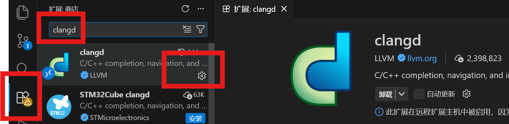
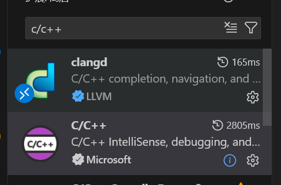
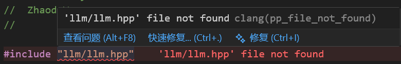
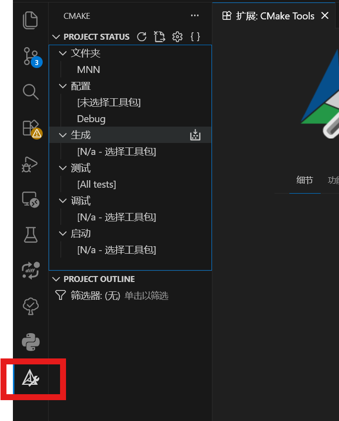
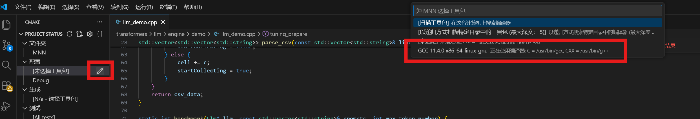
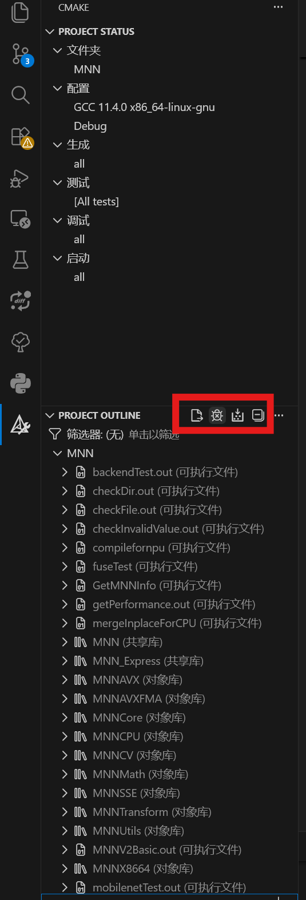
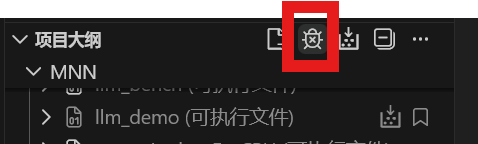
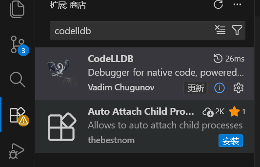
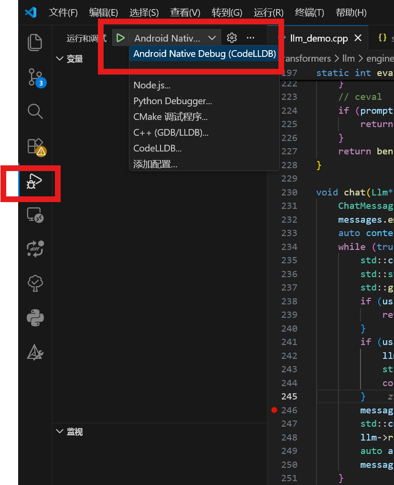
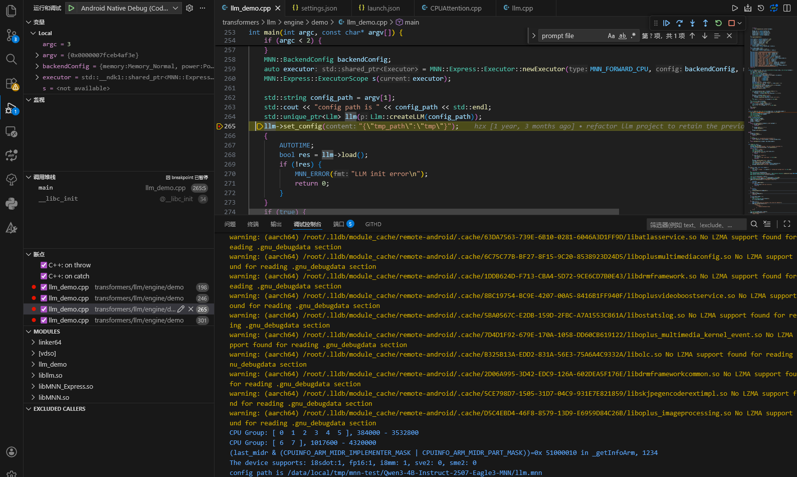

# 交叉编译开发环境配置与远程调试

本文以[MNN](https://github.com/alibaba/MNN)框架为例 介绍交叉编译环境中的常见设置。


## 1. ANDROID_NDK配置

可执行文件在手机侧CPU上运行，需要源代码在编译过程中与ANDROID_NDK 进行交叉编译

- 步骤1：下载最新版软件包, [获取地址](https://developer.android.google.cn/ndk/downloads?hl=zh-cn)(选择对应平台最新稳定版,点击后出现 “Android 软件开发套件许可协议”，勾选后鼠标右键下载按钮可以复制下载链接)

	```bash
	# 服务器端运行
	# 到指定目录 下载 解压 android_ndk 
	cd ~ && mkdir android_ndk && cd ~/android_ndk
	wget https://googledownloads.cn/android/repository/android-ndk-r29-linux.zip
	unzip android-ndk-r29-linux.zip # 这个文件名和下载的版本有关
	# 删除压缩包
	rm android-ndk-r29-linux.zip # 这个文件名和下载的版本有关
	
	# 进入并记住解压后的目录
	# 在目录用"pwd"命令可以获取绝对路径
	cd android-ndk-r29 # 这个目录和下载的版本有关 可以通过ls -lah 显示目录
	```

- 步骤2：配置环境变量

	```bash
	# 服务器端运行
	# 通常会配置ANDROID_NDK_ROOT的环境变量
	# 但MNN中在project/android/build_64.sh 中使用的是$ANDROID_NDK环境变量 所以都设置一下
	➜ export ANDROID_NDK="$HOME/android_ndk/android-ndk-r29" # 环境变量
	➜ $ANDROID_NDK/ndk-build --version	# 验证环境变量
	GNU Make 4.3
	Built for x86_64-pc-linux-gnu
	Copyright (C) 1988-2020 Free Software Foundation, Inc.
	License GPLv3+: GNU GPL version 3 or later <http://gnu.org/licenses/gpl.html>
	This is free software: you are free to change and redistribute it.
	There is NO WARRANTY, to the extent permitted by law.
	
	# 在命令行单次export只会在当前命令行有效 新开的终端不生效
	# 需要把环境变量写到shell的配置文件中 bash对应~/.bashrc zsh对应~/.zshrc
	# !!注意这里重定向是重定向文件末尾 '>>' 符号
	echo 'export ANDROID_NDK="$HOME/android_ndk/android-ndk-r29"' >> ~/.zshrc # 环境变量
	echo 'export ANDROID_NDK_ROOT="$HOME/android_ndk/android-ndk-r29"'  >> ~/.zshrc # 环境变量
	echo 'export PATH="$ANDROID_NDK:$PATH"' >> ~/.zshrc
	# 验证
	➜  ndk-build
	Android NDK: Could not find application project directory !
	Android NDK: Please define the NDK_PROJECT_PATH variable to point to it.
	/root/android_ndk/android-ndk-r29/build/core/build-local.mk:151: *** Android NDK: Aborting    .  Stop.
	```

- 编译测试，[MNN官方文档](https://mnn-docs.readthedocs.io/en/latest/compile/engine.html)

	```bash
	# 服务器端运行
	# 克隆仓库
	git clone https://github.com/alibaba/MNN.git
	# 进入仓库
	cd MNN && cd project/android
	# 主库编译
	# 可以根据开发服务器cpu适当调高 project/android/build_64.sh里编译的线程数
	# make -j256 # 原脚本4线程编译慢
	mkdir build64 && cd build64 && ../build_64.sh
	# 无报错，编译通过
	```

### 1.1 logcat

MNN中的MNN_PRINT MNN_ERROR等信息在android调试上需要通过logcat捕获

```c
#include <android/log.h>
#define MNN_ERROR(format, ...) __android_log_print(ANDROID_LOG_ERROR, "MNNJNI", format, ##__VA_ARGS__)
#define MNN_PRINT(format, ...) __android_log_print(ANDROID_LOG_INFO, "MNNJNI", format, ##__VA_ARGS__)
#endif
```

在连接了adb的终端可以使用， [logcat参考](https://developer.android.google.cn/tools/logcat?hl=zh-cn)

```bash
adb logcat # 所有日志 可以用grep过滤
adb logcat -c # 清除缓冲区
adb logcat -s <Tag>:<Level> # 仅显示指定标签的日志 <Tag>日志的标签 <Level>日志级别 如D(Debug) W(Warning) E(Error)等
```


## 2 VSCode Clangd配置

平时使用IDEA进行cpp开发时，可以智能补全代码、快速跳转到定义/声明，交叉编译环境下可以选择使用[Clangd](https://clangd.llvm.org/installation.html)实现。

- 步骤1：VSCode安装clangd插件

	- 在插件商店搜索下载clangd
		

	- 下载 C/C++插件，并且禁用该插件的补全，（这个插件的补全会与clangd插件冲突，但是cmake tools依赖该插件
		

		在设置中搜索Intelli Sense Engine，并且设置为disable
		

- 步骤2：添加编译选项

	```bash
	# 同上编译位置 MNN目录位置可能不同
	cd MNN && cd project/android/build64
	# 添加编译选项
	../build_64.sh -DCMAKE_EXPORT_COMPILE_COMMANDS=ON
	# 该命令会在编译目录生成compile_commands.json 文件
	# 记录了项目中每个源文件的完整编译命令， 给clangd提供编译信息
	```

- 步骤3：配置clangd

	- 配置settings.json，在项目根目录中创建文件夹.vscode，在文件夹.vscode中创建文件settings.json

		```json
		// path: MNN/.vscode/settings.json 用于为当前项目配置编辑器行为和开发环境设置的文件
		{
		    "clangd.arguments": [
		        "-j=16",	// 索引时使用16线程
		        "--header-insertion=never", // 禁用自动插入头文件
		        "--compile-commands-dir=${workspaceFolder}/project/android/build64", // compile_commands.json 文件路径，可用绝对路径 
		        "--query-driver=/root/android_ndk/android-ndk-r29/toolchains/llvm/prebuilt/linux-x86_64/bin/clang*", //解析 NDK 的 Clang 编译器, 这个路径在compile_commands.json中的个文件编译命令"command"可以找到，带上*号表示通配符, 这个路径也和NDK安装路径有关 因人而异
		        "--clang-tidy" // 代码静态分析
		    ],
		    "clangd.path": "/root/android_ndk/android-ndk-r29/toolchains/llvm/prebuilt/linux-x86_64/bin/clangd", //cland路径
		}
		```

		这里使用ANDROID_NDK中的clangd.path

		```bash
		# 不同版本路径可能略有不同, 可以通过find命令查找，
		# 使用找到的clangd的绝对路径
		➜  cd $ANDROID_NDK      
		➜  find . -type f -iname "clangd"
		./toolchains/llvm/prebuilt/linux-x86_64/bin/clangd
		```

	- 在vscode中使用ctrl+shift+p调出命面板，搜索选择clangd: Restart language server或者Developer: Reload Window，可以在vscode中进行正常代码跳转

	- 配置.clangd,在MNN根目录下创建文件.clangd

		```yaml
		# 消除一些无意义的报错
		Diagnostics:
		  UnusedIncludes: None # 禁用“未使用头文件”警告
		  Suppress:	# 屏蔽指定的警告/提示 按需使用
		    - "macro_is_not_used"
		    - "pp_including_mainfile_in_preamble"
		    - "misleading-indentation"
		```

		Suppress屏蔽的报错信息 可以把鼠标靠近报错的地方查找，例如：括号中的pp_file_not_found
		

		**部分无法索引的可能因为编译宏未打开，例如llm.hpp需要打开```-DMNN_BUILD_LLM=true```才会编译**，查找文件是否编译可以直接在compile_commands.json中搜索对应文件。

- 步骤4：最后的目录结构

	```markdown
	MNN/
	├── .vscode/
	│   └── settings.json
	├── .clangd
	└── ...（其他项目文件和目录，如 include/, source/, transformers/ 等）
	```

## 3 调试

### 3.1 服务器调试

代码出错一直靠printf打印需要麻烦且看不到调用栈，vscode中有直接在服务器上进行逻辑调试的插件。

**注意：这里服务器调试是在服务器上运行，所以编译指令与前面在移动手机运行不同，最终运行是在服务器运行**

- 步骤1：在vscode中安装插件cmake tools
	

- 步骤2：安装完成后侧边栏多出cmake功能区
	

- 步骤3：点击选择工具包，选择在服务器测试时的编译器，如果没有编译器，需自行安装gcc clang等

	

- 步骤4：选择好工具包后，会自动扫描根目录的cmakelist,进行配置，也可以执行点击按钮配置，下图中的按钮是配置、生成所有文件
	

- 步骤5：配置cmake 生成构建系统, 如果需要添加编译宏需要在.vscode/settings.json中添加如下参数

	```json
	{
	    // 下面内容和前面的clagnd设置放在一个{}中
	    "cmake.configureArgs": [ // 编译宏
	        "-DMNN_LOW_MEMORY=true", 
	        "-DMNN_CPU_WEIGHT_DEQUANT_GEMM=true",
	        "-DMNN_BUILD_LLM=true", // 编译MNN-LLM模块
	        "-DMNN_SUPPORT_TRANSFORMER_FUSE=true", // attention模块融合成算子 而不是进一步拆成算子
	    ],
	    "cmake.buildArgs" : ["-j128"], // 编译线程
	    "cmake.generator": "Unix Makefiles", // 使用make构建
	}
	```

- 步骤6：在项目大纲的配置中选择”使用cmake调试器配置所有项目“，然后打开控制面板选择Developer: Reload Window; 重新配置的对象就会刷新在左侧项目大纲
	

- 步骤7：在项目大纲这里选择想调试/生成的文件，右键鼠标可以选择调试

	

	如果调试的可执行文件执行时需要args，需要在.vscode/settings.json中添加参数，

	这里以llm_demo为例，运行llm_demo的命令是```./llm_demo /data/HUGGINGFACE/Qwen3-4B-Instruct-2507-Eagle3-MNN/llm.mnn ```，
	如果follow这个步骤需要自行[下载Qwen3-4B-Instruct-2507-Eagle3-MN模型](https://www.modelscope.cn/models/MNN/Qwen3-4B-Instruct-2507-Eagle3-MNN/summary)，并且复制到llm.mnn的路径

	```json
	{ // 添加到.vscode/settings.json
	    "cmake.debugConfig": {
	        "args": ["/data/HUGGINGFACE/Qwen3-4B-Instruct-2507-Eagle3-MNN/llm.mnn"],
	    }
	}
	```

- 步骤8：在程序中打断点 按照上一步开始调试。如果没有调试器，需自行安装gdb lldb等；这一步需要c/c++插件，未安装见[VSCode Clangd配置](#2 VSCode Clangd配置), 需要禁用部分与clangd冲突功能。

	在终端输入”hello“后成功卡在断点，说明配置成功。

	**说明：cmake tools的配置编译产物在根目录的build文件夹下**
	

### 3.2 远程调试（launch模式）

部分在指定手机的后端运行的代码无法在服务器调试，需要通过远程调试。
**远程调试需要建立服务器到手机的通信链路，如果链路带宽有限启动调试会很慢，所以部分与运行后端无关的逻辑推荐服务器调试，并且推荐的服务器到手机的通信链路使用TailScale/EasyTier隧道的方式**

- 原理：服务器上通过ANDROID_NDK目录下的lldb 借助服务器->手机的通信链路 与手机上运行的ANDROID_NDK目录下的lldb-server通信，进行远程调试。总结需要完成的事情是: (1)找ANDROID_NDK目录下的lldb lldb-server文件， (2)做两个端口的通信转发链路，在手机运行lldb-server (3)编译把所需运行文件推送到手机 (4)下载 配置CodeLLDB插件 (5) 配置调试参数 开始调试

- 步骤1：VSCode安装CodeLLDB插件 [官方文档](https://github.com/vadimcn/codelldb/blob/v1.12.1/MANUAL.md)
	

- 步骤2：查找lldb lldb-server。lldb和lldb-server是一对，调试时服务器上的lldb会连接设备端中启动的lldb-server。[lldb文档](https://lldb.llvm.org/use/tutorial.html)

	```bash
	# 服务器端运行
	➜  cd $ANDROID_NDK                     
	➜  find . -type f -iname "lldb"  
	./toolchains/llvm/prebuilt/linux-x86_64/bin/lldb
	➜  find . -type f -iname "lldb-server"
	./toolchains/llvm/prebuilt/linux-x86_64/lib/clang/21/lib/linux/arm/lldb-server
	./toolchains/llvm/prebuilt/linux-x86_64/lib/clang/21/lib/linux/i386/lldb-server
	./toolchains/llvm/prebuilt/linux-x86_64/lib/clang/21/lib/linux/riscv64/lldb-server
	./toolchains/llvm/prebuilt/linux-x86_64/lib/clang/21/lib/linux/x86_64/lldb-server
	./toolchains/llvm/prebuilt/linux-x86_64/lib/clang/21/lib/linux/aarch64/lldb-server
	```

- 步骤3：构建通信链路，lldb与lldb-server之间的通信需要启动额外的通信端口，所以构建通信链路时需要开启两个端口

	```bash
	# 本地运行
	# 为了简化说明 adb调试端口统一设置为30303 lldb通信端口设置为31313
	
	# adb 远程调试端口应该设置为30303
	adb tcpip 30303 # 插入usb连接手机 启动无线adb调试，部分机型可能需要在开发者模式设置允许无线调试
	adb connect ip_P:30303  # 验证无线adb连接，手机的ip可能会随着网络变化，可以在手机设置中搜索ip查看，或者路由器页面查看，或者adb shell ip a查看
	
	# 下面的host_name是本地通过SSH连接服务器时config中的Host别名
	# 可以修改为本地L通过ssh连接服务器S的user ip port, 不是需要转发的ip和端口
	
	# 构建adb调试端口转发
	ssh -N -R 0.0.0.0:30303:localhost:30303 host_name # 将服务器30303端口转发至本地30303端口
	adb forward tcp:30303 tcp:30303 # 将本地30303端口转发给adb设备30303端口
	
	# 构建lldb通信端口转发
	ssh -N -R 0.0.0.0:31313:localhost:31313 host_name # 将服务器31313端口转发至本地31313端口
	adb forward tcp:31313 tcp:31313 # 将本地31313端口转发给adb设备31313端口
	```

- 步骤4：给手机端推送并启动lldb-server，由于adb连接根目录下有许多系统文件 不root没有权限 所以通常文件推送到/data/local/tmp目录下运行

	```bash
	# 服务器运行
	
	# 1. 连接adb
	# sudo apt install adb -y 若无adb
	adb connect 127.0.0.1:30303 # 连接adb
	# 2. 查看指令集，大部分手机是arm64-v8a架构，需要aarch64 版本的lldb-server
	➜  adb shell getprop ro.product.cpu.abi
	arm64-v8a
	
	# 3. 把lldb-server推送给手机端 根据上面的查找路径 推送
	➜  adb shell mkdir /data/local/tmp/mnn-test/   # 创建路径
	➜  adb push $ANDROID_NDK/toolchains/llvm/prebuilt/linux-x86_64/lib/clang/21/lib/linux/aarch64/lldb-server /data/local/tmp/mnn-test/ # !!注意末尾的 / 表示目录
	
	# 4. 进入adb 运行lldb-server
	➜  adb shell  
	RE602CL1:/ $ cd /data/local/tmp/mnn-test/                                           
	RE602CL1:/data/local/tmp/mnn-test $ chmod a+x lldb-server               
	RE602CL1:./lldb-server platform --server --listen "*:31313" --log-channels "lldb process" # 这里端口要对应上lldb链路的端口
	
	# 说明可以通过下面命令清理/查看adb转发的端口列表
	# adb forward --remove-all
	# adb forward --list
	
	# 5. 测试
	# 另起一个shell 启动lldb
	➜ cd $ANDROID_NDK
	➜ export PATH=$(pwd)/toolchains/llvm/prebuilt/linux-x86_64/python3/bin:$PATH # 临时设置python路径，后面调试无需设置
	➜ export LD_LIBRARY_PATH=$(pwd)/toolchains/llvm/prebuilt/linux-x86_64/python3/lib:$LD_LIBRARY_PATH # 临时设置环境变量，后面调试无需设置
	# 具体路径可以根据缺失的包查找 如下
	# ➜ find . -type f -iname "libpython3.11.so.1.0"
	#./toolchains/llvm/prebuilt/linux-x86_64/python3/lib/libpython3.11.so.1.0
	➜ adb connect 127.0.0.1:30303 # 连接adb
	already connected to 127.0.0.1:30303
	➜ ./toolchains/llvm/prebuilt/linux-x86_64/bin/lldb # 启动lldb
	No entry for terminal type "xterm-256color";
	using dumb terminal settings.
	(lldb) version
	lldb version 21.0.0 (/mnt/disks/build-disk/src/googleplex-android/llvm-r563880-release/out/llvm-project/lldb revision 5e96669f06077099aa41290cdb4c5e6fa0f59349)
	  clang revision 5e96669f06077099aa41290cdb4c5e6fa0f59349
	  llvm revision 5e96669f06077099aa41290cdb4c5e6fa0f59349
	(lldb) platform select remote-android	# 选择平台
	  Platform: remote-android
	 Connected: no
	(lldb) platform connect connect://localhost:31313 # 连接设备
	  Platform: remote-android
	    Triple: aarch64-unknown-linux-android
	OS Version: 35 (6.6.30-android15-8-g013ec21bba94-abogki383916444-4k)
	  Hostname: localhost
	 Connected: yes
	WorkingDir: /data/local/tmp/mnn-test
	    Kernel: #1 SMP PREEMPT Tue Dec 17 23:36:49 UTC 2024
	(lldb) quit # 以上流程验证成功说明链路测试成功，!!!!!quit退出当前lldb!!!!!
	
	# -------------------------------
	# 连接成功后lldb-server侧出现连接建立提示
	# RE602CL1:/data/local/tmp/mnn-test $ ./lldb-server platform --server --listen "*:31313"
	# Connection established.
	```

- 步骤5：配置.vscode/launch.json文件，设置调试参数,依旧以llm_demo为例，部分参数需要和前面的设置一致。这里**使用launch模式 无法使用标准输入**，样例使用llm_demo的另一个用法--文件输入。需要标准输入要使用attach模式 在adb窗口运行进程并attach给lldb。

	```json
	{
	    "version": "0.2.0",
	    "configurations": [
	        {
	            "name": "Android Native Debug (CodeLLDB)",
	            "type": "lldb",   
	            "request": "launch",
	            "program": "${workspaceFolder}/project/android/build64/llm_demo", // 要调试的可执行文件
	            "initCommands": [
	                "platform select remote-android", // 选择远程android平台，参考lldb文档https://lldb.llvm.org/use/remote.html
	                "platform connect connect://127.0.0.1:31313", // 连接lldb-server
	                "settings set target.inherit-env false", // 禁用继承本地环境变量
	                "platform settings -w /data/local/tmp/mnn-test", // 设置调试目录
	                "platform status", // 验证连接状态
	            ],
	            "preRunCommands": [
	                "settings set target.env-vars LD_LIBRARY_PATH=/data/local/tmp/mnn-test", //设置环境变量，MNN端侧运行需要设置环境变量
	            ],
	            "args": [
	                "/data/local/tmp/mnn-test/Qwen3-4B-Instruct-2507-Eagle3-MNN/llm.mnn", // 调试参数
	                "hello.txt
	            ],
	        }
	    ]
	}
	```

- 步骤6：编译，并且推送代码和所需的动态链接库。**!!注意这里一定要把编译修改为Debug才能运行**

	```bash
	# 服务器运行
	# 移动到编译目录
	cd MNN && cd project/android/build64
	# 编译类型为从Release改为Debug
	vim ../build_64.sh # -DCMAKE_BUILD_TYPE=Debug \ # 从Release改为Debug
	# 编译
	../build_64.sh -DCMAKE_EXPORT_COMPILE_COMMANDS=ON -DMNN_LOW_MEMORY=true -DMNN_CPU_WEIGHT_DEQUANT_GEMM=true -DMNN_BUILD_LLM=true -DMNN_SUPPORT_TRANSFORMER_FUSE=true
	
	# 推送可执行文件和动态库，需要的动态链接库可以运行测试 缺啥补啥
	adb connect 127.0.0.1:30303
	adb push llm_demo /data/local/tmp/mnn-test/
	adb push /data/HUGGINGFACE/Qwen3-4B-Instruct-2507-Eagle3-MNN/ /data/local/tmp/mnn-test/Qwen3-4B-Instruct-2507-Eagle3-MNN/
	adb push libllm.so /data/local/tmp/mnn-test/
	adb push libMNN_Express.so /data/local/tmp/mnn-test/
	adb push libMNN.so /data/local/tmp/mnn-test/
	# 使用launch模式 无法使用标准输入 使用文件方式输入
	echo hello > hello.txt && adb push hello.txt /data/local/tmp/mnn-test/ 
	
	# 测试能否运行
	adb shell # 进入adb
	cd /data/local/tmp/mnn-test/ # 进入目录
	export LD_LIBRARY_PATH=/data/local/tmp/mnn-test # 临时设置环境变量
	./llm_demo /data/local/tmp/mnn-test/Qwen3-4B-Instruct-2507-Eagle3-MNN/llm.mnn # 运行测试
	
	# 测试如下 输入hello 有输出生成 表示能够编译运行
	CPU Group: [ 0  1  2  3  4  5 ], 384000 - 3532800
	CPU Group: [ 6  7 ], 1017600 - 4320000
	(last_midr & (CPUINFO_ARM_MIDR_IMPLEMENTER_MASK | CPUINFO_ARM_MIDR_PART_MASK))=0x 51000010 in _getInfoArm, 1234 
	The device supports: i8sdot:1, fp16:1, i8mm: 1, sve2: 0, sme2: 0
	config path is /data/local/tmp/mnn-test/Qwen3-4B-Instruct-2507-Eagle3-MNN/llm.mnn
	main, 267, cost time: 5396.304199 ms
	Prepare for tuning opt Begin
	Prepare for tuning opt End
	main, 275, cost time: 475.540009 ms
	
	User: hello
	
	A: Hello! How can I help you today? 😊
	
	# 调试前应该有下面文件
	130|RE602CL1:/data/local/tmp/mnn-test $ ls -lah
	total 33K
	drwxrwxrwx 3 shell shell 3.3K 2026-01-30 15:53 .
	drwxrwx--x 7 shell shell 3.3K 2026-01-29 17:18 ..
	drwxrwxr-x 3 shell shell 3.3K 2026-01-30 12:34 Qwen3-4B-Instruct-2507-Eagle3-MNN
	-rw-rw-rw- 1 shell shell    6 2026-01-30 15:53 hello.txt
	-rwxrwxrwx 1 shell shell 2.6M 2026-01-30 12:39 libMNN.so
	-rwxrwxrwx 1 shell shell 714K 2026-01-30 12:40 libMNN_Express.so
	-rwxrwxrwx 1 shell shell 1.4M 2026-01-30 12:40 libllm.so
	-rwxrwxrwx 1 shell shell  28M 2025-10-03 04:45 lldb-server
	-rwx------ 1 shell shell  30K 2026-01-30 12:40 llm_demo
	```

- 步骤7：断点调试 （记得把前面测试的lldb进程结束 释放端口，这里设置的参数不同断点位置也修改了下）

	

	开始调试后，会通过通信加载大量符号表，然后停在断点处
	

	交叉编译环境，codelldb插件使用的lldb**可能**与ANDROID_NDK目录下的lldb-server版本不匹配,但是目前测试暂时没遇到，修改插件使用的lldb可能比较麻烦，包括lldb.library等应该都要修改（前面测试lldb用到的环境变量）

### 3.3 远程调试（Attach模式 尝试失败）

**理论上**“launch模式不能同步标准输入，改用attach模式可以在adb启动调试进程并通过lldb直接attach到该进程，随后调试程序在adb中应该可以正常进行stdio行为。”**但lldb命令行模式可以成功，使用vscode插件测试无法成功**。

- 步骤1：同样的构建lldb与lldb-server链路 并且在adb执行lldb-server

- 步骤2：配置launch.json

	```- json
	{
	    "version": "0.2.0",
	    "inputs": [
	        {
	            "id": "PidAttach",
	            "type": "promptString",
	            "description": "Enter the PID to attach to",
	            "default": ""
	        }
	    ],
	    "configurations": [
	        {
	            "name": "Android LLDB Attach",
	            "type": "lldb",
	            "request": "attach",
	            "pid": "${input:PidAttach}",
	            "program": "${workspaceFolder}/project/android/build64/llm_demo", 
	            "initCommands": [
	                "platform select remote-android",
	                "platform connect connect://127.0.0.1:31313",
	                "settings set target.inherit-env false",
	                "platform settings -w /data/local/tmp/mnn-test",
	                // "platform status",
	                // "platform process list",  // 查看进程列表
	                "settings set target.disable-stdio true", // 禁用lldb的stdio拦截 如果希望使用stdio参数应该也要禁用
	            ],
	        }
	    ]
	}
	```

- 步骤3：启动调试，先在adb内启动llm_demo

	```bash
	adb shell # 进入adb
	cd /data/local/tmp/mnn-test/ # 进入目录
	export LD_LIBRARY_PATH=/data/local/tmp/mnn-test # 临时设置环境变量
	./llm_demo /data/local/tmp/mnn-test/Qwen3-4B-Instruct-2507-Eagle3-MNN/llm.mnn # 运行测试
	```

	然后设置断点开始调试，失败log:

	```bash
	# 另起一个adb发现llm_demo应该成功被attach
	RE602CL1:/ $ ps -a                                                                    
	USER           PID  PPID        VSZ    RSS WCHAN            ADDR S NAME                
	shell         9239  9226    7086452 2820732 ptrace_st+         0 t llm_demo
	shell         9243  9221    8732304   6912 do_sys_po+          0 S lldb-server
	shell         9246  9243    8697360   7552 do_select           0 S lldb-server
	shell         9250  9243    8700968  10536 do_sys_po+          0 S lldb-server
	shell         9285  9232    2289024   5864 0                   0 R ps
	
	# 在vscode输出中找到lldb(需要在settings.json中设置"lldb.verboseLogging": true)
	# 正常执行命令 并且加载了部分符号表
	# 但是调试没有正常开始
 	```
	<details><summary>vscode log</summary>
	
		Verbose logging: on  (Use "lldb.verboseLogging" setting to change)
		Platform: linux x64
		Initial debug configuration: {
		  name: 'Android LLDB Attach',
		  type: 'lldb',
		  request: 'attach',
		  pid: '${input:PidAttach}',
		  program: '${workspaceFolder}/project/android/build64/llm_demo',
		  initCommands: [
		    'platform select remote-android',
		    'platform connect connect://127.0.0.1:31313',
		    'settings set target.inherit-env false',
		    'platform settings -w /data/local/tmp/mnn-test',
		    'platform status',
		    'platform process list',
		    'settings show target.disable-stdio',
		    'settings set target.disable-stdio true',
		    'settings show target.disable-stdio',
		    'settings set target.preload-symbols false'
		  ],
		  __configurationTarget: 6
		}
		Resolved debug configuration: {
		  name: 'Android LLDB Attach',
		  type: 'lldb',
		  request: 'attach',
		  pid: '9239',
		  program: '/workspace/code/MNN/project/android/build64/llm_demo',
		  initCommands: [
		    'platform select remote-android',
		    'platform connect connect://127.0.0.1:31313',
		    'settings set target.inherit-env false',
		    'platform settings -w /data/local/tmp/mnn-test',
		    'platform status',
		    'platform process list',
		    'settings show target.disable-stdio',
		    'settings set target.disable-stdio true',
		    'settings show target.disable-stdio',
		    'settings set target.preload-symbols false'
		  ],
		  __configurationTarget: 6,
		  relativePathBase: '/workspace/code/MNN',
		  _adapterSettings: {
		    displayFormat: 'auto',
		    showDisassembly: 'auto',
		    dereferencePointers: true,
		    suppressMissingSourceFiles: true,
		    evaluationTimeout: 5,
		    consoleMode: 'commands',
		    sourceLanguages: null,
		    scriptConfig: {},
		    evaluateForHovers: true,
		    commandCompletions: true
		  }
		}
		Launching adapter
		liblldb: 
		lldbServer: 
		environment: {}
		settings: { evaluateForHovers: true, commandCompletions: true }
		[0.10 INFO codelldb] Loaded "/root/.vscode-server/extensions/vadimcn.vscode-lldb-1.12.1/lldb/lib/liblldb.so", version="lldb version 21.1.7-codelldb"
		[0.376 DEBUG codelldb] Connecting to 127.0.0.1:35049
		[0.376 DEBUG codelldb] New debug session
		[0.402 DEBUG codelldb::python] Compiling code: codelldb.interface.update_adapter_settings("""{"displayFormat":null,"showDisassembly":null,"dereferencePointers":null,"containerSummary":null,"evaluationTimeout":null,"summaryTimeout":null,"suppressMissingSourceFiles":null,"consoleMode":null,"sourceLanguages":null,"scriptConfig":null,"evaluateForHovers":true,"commandCompletions":true}""", globals())
		[0.402 DEBUG codelldb::python] Created code object at 0x7f6fc0597110
		[0.402 DEBUG codelldb::python] Evaluating code object at 0x7f6fc0597110
		[0.402 DEBUG codelldb::python] Evaluation result: (void) result =
		
		[0.416 DEBUG codelldb::python] Dropping object at 0x7f6fc0597110
		[0.434 DEBUG codelldb::dap_codec] --> {"command":"initialize","arguments":{"clientID":"vscode","clientName":"Visual Studio Code","adapterID":"lldb","pathFormat":"path","linesStartAt1":true,"columnsStartAt1":true,"supportsVariableType":true,"supportsVariablePaging":true,"supportsRunInTerminalRequest":true,"locale":"zh-cn","supportsProgressReporting":true,"supportsInvalidatedEvent":true,"supportsMemoryReferences":true,"supportsArgsCanBeInterpretedByShell":true,"supportsMemoryEvent":true,"supportsStartDebuggingRequest":true,"supportsANSIStyling":true},"type":"request","seq":1}
		[0.435 DEBUG codelldb::dap_codec] <-- {"seq":1,"type":"response","request_seq":1,"success":true,"command":"initialize","body":{"exceptionBreakpointFilters":[{"default":true,"filter":"cpp_throw","label":"C++: on throw","supportsCondition":true},{"default":false,"filter":"cpp_catch","label":"C++: on catch","supportsCondition":true}],"supportTerminateDebuggee":true,"supportsCancelRequest":true,"supportsClipboardContext":true,"supportsCompletionsRequest":true,"supportsConditionalBreakpoints":true,"supportsConfigurationDoneRequest":true,"supportsDataBreakpointBytes":true,"supportsDataBreakpoints":true,"supportsDelayedStackTraceLoading":true,"supportsDisassembleRequest":true,"supportsEvaluateForHovers":true,"supportsExceptionFilterOptions":true,"supportsExceptionInfoRequest":true,"supportsFunctionBreakpoints":true,"supportsGotoTargetsRequest":true,"supportsHitConditionalBreakpoints":true,"supportsInstructionBreakpoints":true,"supportsLogPoints":true,"supportsModulesRequest":true,"supportsReadMemoryRequest":true,"supportsRestartRequest":true,"supportsSetVariable":true,"supportsStepInTargetsRequest":true,"supportsSteppingGranularity":true,"supportsWriteMemoryRequest":true}}
		[0.479 DEBUG codelldb::dap_codec] --> {"command":"attach","arguments":{"name":"Android LLDB Attach","type":"lldb","request":"attach","pid":"9239","program":"/workspace/code/MNN/project/android/build64/llm_demo","initCommands":["platform select remote-android","platform connect connect://127.0.0.1:31313","settings set target.inherit-env false","platform settings -w /data/local/tmp/mnn-test","platform status","platform process list","settings show target.disable-stdio","settings set target.disable-stdio true","settings show target.disable-stdio","settings set target.preload-symbols false"],"__configurationTarget":6,"relativePathBase":"/workspace/code/MNN","_adapterSettings":{"displayFormat":"auto","showDisassembly":"auto","dereferencePointers":true,"suppressMissingSourceFiles":true,"evaluationTimeout":5,"consoleMode":"commands","sourceLanguages":null,"scriptConfig":{},"evaluateForHovers":true,"commandCompletions":true},"__sessionId":"d48f9fb7-6d82-457d-8328-c1b37b556795"},"type":"request","seq":2}
		[0.479 DEBUG codelldb::python] Compiling code: codelldb.interface.update_adapter_settings("""{"displayFormat":"auto","showDisassembly":"auto","dereferencePointers":true,"containerSummary":null,"evaluationTimeout":5.0,"summaryTimeout":null,"suppressMissingSourceFiles":true,"consoleMode":"commands","sourceLanguages":null,"scriptConfig":{},"evaluateForHovers":true,"commandCompletions":true}""", globals())
		[0.479 DEBUG codelldb::python] Created code object at 0x7f6fc0597110
		[0.479 DEBUG codelldb::python] Evaluating code object at 0x7f6fc0597110
		[0.479 DEBUG codelldb::python] Evaluation result: (void) result =
		
		[0.480 DEBUG codelldb::python] Dropping object at 0x7f6fc0597110
		[0.480 DEBUG codelldb::dap_codec] <-- {"seq":2,"type":"event","event":"output","body":{"category":"console","output":"Console is in 'commands' mode, prefix expressions with '?'.\n"}}
		[0.480 DEBUG codelldb::dap_codec] <-- {"seq":3,"type":"event","event":"output","body":{"category":"console","output":"Executing script: initCommands\n"}}
		[0.480 DEBUG codelldb::debug_session] platform select remote-android -> SuccessFinishResult, Error:  Success
		Output Message:
		  Platform: remote-android
		 Connected: no
		
		[0.480 DEBUG codelldb::dap_codec] <-- {"seq":4,"type":"event","event":"output","body":{"category":"console","output":"  Platform: remote-android\n Connected: no\n\n"}}
		[1.37 DEBUG codelldb::debug_session] platform connect connect://127.0.0.1:31313 -> SuccessFinishResult, Error:  Success
		Output Message:
		  Platform: remote-android
		    Triple: aarch64-unknown-linux-android
		OS Version: 35 (6.6.30-android15-8-g013ec21bba94-abogki383916444-4k)
		  Hostname: localhost
		 Connected: yes
		WorkingDir: /data/local/tmp/mnn-test
		    Kernel: #1 SMP PREEMPT Tue Dec 17 23:36:49 UTC 2024
		
		[1.37 DEBUG codelldb::dap_codec] <-- {"seq":5,"type":"event","event":"output","body":{"category":"console","output":"  Platform: remote-android\n    Triple: aarch64-unknown-linux-android\nOS Version: 35 (6.6.30-android15-8-g013ec21bba94-abogki383916444-4k)\n  Hostname: localhost\n Connected: yes\nWorkingDir: /data/local/tmp/mnn-test\n    Kernel: #1 SMP PREEMPT Tue Dec 17 23:36:49 UTC 2024\n\n"}}
		[1.37 DEBUG codelldb::debug_session] settings set target.inherit-env false -> SuccessFinishResult, Error:  Success
		[1.137 DEBUG codelldb::debug_session] platform settings -w /data/local/tmp/mnn-test -> SuccessFinishNoResult, Error:  Success
		[1.233 DEBUG codelldb::debug_session] platform status -> SuccessFinishResult, Error:  Success
		Output Message:
		  Platform: remote-android
		    Triple: aarch64-unknown-linux-android
		OS Version: 35 (6.6.30-android15-8-g013ec21bba94-abogki383916444-4k)
		  Hostname: localhost
		 Connected: yes
		WorkingDir: /data/local/tmp/mnn-test
		    Kernel: #1 SMP PREEMPT Tue Dec 17 23:36:49 UTC 2024
		
		[1.234 DEBUG codelldb::dap_codec] <-- {"seq":6,"type":"event","event":"output","body":{"category":"console","output":"  Platform: remote-android\n    Triple: aarch64-unknown-linux-android\nOS Version: 35 (6.6.30-android15-8-g013ec21bba94-abogki383916444-4k)\n  Hostname: localhost\n Connected: yes\nWorkingDir: /data/local/tmp/mnn-test\n    Kernel: #1 SMP PREEMPT Tue Dec 17 23:36:49 UTC 2024\n\n"}}
		[1.947 DEBUG codelldb::debug_session] platform process list -> SuccessFinishNoResult, Error:  Success
		Output Message:
		6 matching processes were found on "remote-android"
		
		PID    PARENT USER       TRIPLE                         NAME
		====== ====== ========== ============================== ============================
		3264   1      shell                                     
		9221   3264   shell      aarch64-unknown-linux-android  sh
		9226   3264   shell      aarch64-unknown-linux-android  sh
		9232   3264   shell      aarch64-unknown-linux-android  sh
		9239   9226   shell      aarch64-unknown-linux-android  llm_demo
		10599  9221   shell      aarch64-unknown-linux-android  lldb-server
		
		[1.947 DEBUG codelldb::debug_session] settings show target.disable-stdio -> SuccessFinishResult, Error:  Success
		Output Message:
		target.disable-stdio (boolean) = false
		
		[1.947 DEBUG codelldb::dap_codec] <-- {"seq":7,"type":"event","event":"output","body":{"category":"console","output":"6 matching processes were found on \"remote-android\"\n\nPID    PARENT USER       TRIPLE                         NAME\n====== ====== ========== ============================== ============================\n3264   1      shell                                     \n9221   3264   shell      aarch64-unknown-linux-android  sh\n9226   3264   shell      aarch64-unknown-linux-android  sh\n9232   3264   shell      aarch64-unknown-linux-android  sh\n9239   9226   shell      aarch64-unknown-linux-android  llm_demo\n10599  9221   shell      aarch64-unknown-linux-android  lldb-server\n\n"}}
		[1.947 DEBUG codelldb::debug_session] settings set target.disable-stdio true -> SuccessFinishResult, Error:  Success
		[1.947 DEBUG codelldb::debug_session] settings show target.disable-stdio -> SuccessFinishResult, Error:  Success
		Output Message:
		target.disable-stdio (boolean) = true
		
		[1.947 DEBUG codelldb::debug_session] settings set target.preload-symbols false -> SuccessFinishResult, Error:  Success
		[1.947 DEBUG codelldb::dap_codec] <-- {"seq":8,"type":"event","event":"output","body":{"category":"console","output":"target.disable-stdio (boolean) = false\n\n"}}
		[1.947 DEBUG codelldb::dap_codec] <-- {"seq":9,"type":"event","event":"output","body":{"category":"console","output":"target.disable-stdio (boolean) = true\n\n"}}
		INFO(Python) 13:09:06 lang_support: languages: set()
		[2.51 DEBUG codelldb::dap_codec] <-- {"seq":10,"type":"event","event":"initialized"}
		[2.94 DEBUG codelldb::dap_codec] --> {"command":"setBreakpoints","arguments":{"source":{"name":"llm_demo.cpp","path":"/workspace/code/MNN/transformers/llm/engine/demo/llm_demo.cpp"},"lines":[197,246,265,301],"breakpoints":[{"line":197},{"line":246},{"line":265},{"line":301}],"sourceModified":false},"type":"request","seq":3}
		[2.104 DEBUG codelldb::debug_session] Debug event: 0x55938b1e6058 Event: broadcaster = 0x55938b1cafb0 (lldb.target), type = 0x00000001 (breakpoint-changed), data = {bkpt: 1 type: breakpoint added}
		[2.104 DEBUG codelldb::debug_session] Debug event: 0x55938bbb0cd8 Event: broadcaster = 0x55938b1cafb0 (lldb.target), type = 0x00000001 (breakpoint-changed), data = {bkpt: 2 type: breakpoint added}
		[2.104 DEBUG codelldb::dap_codec] <-- {"seq":11,"type":"response","request_seq":3,"success":true,"command":"setBreakpoints","body":{"breakpoints":[{"id":1,"line":198,"message":"Resolved locations: 0","verified":true},{"id":2,"line":246,"message":"Resolved locations: 0","verified":true},{"id":3,"line":265,"message":"Resolved locations: 0","verified":true},{"id":4,"line":301,"message":"Resolved locations: 0","verified":true}]}}
		[2.104 DEBUG codelldb::debug_session] Debug event: 0x55938be74b38 Event: broadcaster = 0x55938b1cafb0 (lldb.target), type = 0x00000001 (breakpoint-changed), data = {bkpt: 3 type: breakpoint added}
		[2.104 DEBUG codelldb::debug_session] Debug event: 0x55938be759d8 Event: broadcaster = 0x55938b1cafb0 (lldb.target), type = 0x00000001 (breakpoint-changed), data = {bkpt: 4 type: breakpoint added}
		[2.104 DEBUG codelldb::dap_codec] --> {"command":"setFunctionBreakpoints","arguments":{"breakpoints":[]},"type":"request","seq":4}
		[2.104 DEBUG codelldb::dap_codec] --> {"command":"setInstructionBreakpoints","arguments":{"breakpoints":[]},"type":"request","seq":5}
		[2.104 DEBUG codelldb::dap_codec] --> {"command":"setExceptionBreakpoints","arguments":{"filters":[],"filterOptions":[{"filterId":"cpp_throw"},{"filterId":"cpp_catch"}]},"type":"request","seq":6}
		[2.104 DEBUG codelldb::dap_codec] --> {"command":"setDataBreakpoints","arguments":{"breakpoints":[]},"type":"request","seq":7}
		[2.104 DEBUG codelldb::dap_codec] <-- {"seq":12,"type":"response","request_seq":4,"success":true,"command":"setFunctionBreakpoints","body":{"breakpoints":[]}}
		[2.104 DEBUG codelldb::dap_codec] <-- {"seq":13,"type":"response","request_seq":5,"success":true,"command":"setInstructionBreakpoints","body":{"breakpoints":[]}}
		[2.104 DEBUG codelldb::debug_session] Debug event: 0x55938be759d8 Event: broadcaster = 0x55938b1cafb0 (lldb.target), type = 0x00000001 (breakpoint-changed), data = {bkpt: 5 type: breakpoint added}
		[2.104 DEBUG codelldb::debug_session] Debug event: 0x55938be74b38 Event: broadcaster = 0x55938b1cafb0 (lldb.target), type = 0x00000001 (breakpoint-changed), data = {bkpt: 6 type: breakpoint added}
		[2.104 DEBUG codelldb::dap_codec] <-- {"seq":14,"type":"response","request_seq":6,"success":true,"command":"setExceptionBreakpoints","body":{"breakpoints":[{"id":5,"message":"Resolved locations: 0","verified":false},{"id":6,"message":"Resolved locations: 0","verified":false}]}}
		[2.104 DEBUG codelldb::dap_codec] <-- {"seq":15,"type":"response","request_seq":7,"success":true,"command":"setDataBreakpoints","body":{"breakpoints":[]}}
		[2.208 DEBUG codelldb::dap_codec] --> {"command":"configurationDone","type":"request","seq":8}
		warning: (aarch64) /root/.lldb/module_cache/remote-android/.cache/8C68F140-AAA2-F707-F730-F2EE4E510120/libandroidfw.so No LZMA support found for reading .gnu_debugdata section
		warning: (aarch64) /root/.lldb/module_cache/remote-android/.cache/47A4DF2E-C980-CA7B-EE2C-5162D1311A67/libpowermanager.so No LZMA support found for reading .gnu_debugdata section
		warning: (aarch64) /root/.lldb/module_cache/remote-android/.cache/9DF5DFA7-C0A9-BEE1-18E8-59821ACCE119/libhidlbase.so No LZMA support found for reading .gnu_debugdata section
		warning: (aarch64) /root/.lldb/module_cache/remote-android/.cache/B91287F0-90CF-9F69-4DDD-2F1A515321DD/libandroid_runtime.so No LZMA support found for reading .gnu_debugdata section
		warning: (aarch64) /root/.lldb/module_cache/remote-android/.cache/59856B9D-1F82-D3A6-C71D-66834CA846B9/libGLESv2.so No LZMA support found for reading .gnu_debugdata section
		warning: (aarch64) /root/.lldb/module_cache/remote-android/.cache/F4D570AA-256C-18CF-EA9D-AE414A89DA7D/libm.so No LZMA support found for reading .gnu_debugdata section
		warning: (aarch64) /root/.lldb/module_cache/remote-android/.cache/E5A3DA1A-4375-273B-68D0-BD446CDE5B09/libPlatformProperties.so No LZMA support found for reading .gnu_debugdata section
		warning: (aarch64) /root/.lldb/module_cache/remote-android/.cache/DE46E75F-F2ED-1E2C-471D-4636BABCB461/libgralloctypes.so No LZMA support found for reading .gnu_debugdata section
		warning: (aarch64) /root/.lldb/module_cache/remote-android/.cache/59EDC081-6CC9-8412-738C-D7D9FD088A51/android.hardware.graphics.bufferqueue@2.0.so No LZMA support found for reading .gnu_debugdata section
		warning: (aarch64) /root/.lldb/module_cache/remote-android/.cache/F7541D18-8FBA-9039-6D97-EC2354A99C0C/libandroid.so No LZMA support found for reading .gnu_debugdata section
		warning: (aarch64) /root/.lldb/module_cache/remote-android/.cache/B18C8A03-80E8-9331-80E2-E5D0A8F17968/libhardware.so No LZMA support found for reading .gnu_debugdata section
		warning: (aarch64) /root/.lldb/module_cache/remote-android/.cache/236EA1BC-94E0-AFD5-BC7F-F1431CE6E873/libui.so No LZMA support found for reading .gnu_debugdata section
		warning: (aarch64) /root/.lldb/module_cache/remote-android/.cache/9C5275F2-9E5F-BCAB-CA91-F471539F6C33/libharfbuzz_ng.so No LZMA support found for reading .gnu_debugdata section
		warning: (aarch64) /root/.lldb/module_cache/remote-android/.cache/49F04F9F-4BAB-7644-EBE0-CD12D5CBA422/android.media.audiopolicy-aconfig-cc.so No LZMA support found for reading .gnu_debugdata section
		warning: (aarch64) /root/.lldb/module_cache/remote-android/.cache/F643E105-5895-E50E-6646-2991C8BD651A/libsensor.so No LZMA support found for reading .gnu_debugdata section
		warning: (aarch64) /root/.lldb/module_cache/remote-android/.cache/D4EFBE1C-EE05-5ADB-7BC0-6563275B325A/libactivitymanager_aidl.so No LZMA support found for reading .gnu_debugdata section
		warning: (aarch64) /root/.lldb/module_cache/remote-android/.cache/F4788000-0CAD-34AE-85A3-A6D6EB47AF56/libnetd_client.so No LZMA support found for reading .gnu_debugdata section
		warning: (aarch64) /root/.lldb/module_cache/remote-android/.cache/E9F6E11C-F330-D7B5-DA0A-E574B08DE2BF/libappfuse.so No LZMA support found for reading .gnu_debugdata section
		warning: (aarch64) /root/.lldb/module_cache/remote-android/.cache/1ABE5FF0-44ED-C7D5-EDEC-7513BEFDFB08/libhwui.so No LZMA support found for reading .gnu_debugdata section
		warning: (aarch64) /root/.lldb/module_cache/remote-android/.cache/6616E752-0D49-82C8-B16F-490C2FCE7B07/libxml2.so No LZMA support found for reading .gnu_debugdata section
		warning: (aarch64) /root/.lldb/module_cache/remote-android/.cache/D7BFEF10-7332-8147-237F-DCD213DDB0F4/libEGL.so No LZMA support found for reading .gnu_debugdata section
		warning: (aarch64) /root/.lldb/module_cache/remote-android/.cache/5A4C3962-7C1C-0C27-B85E-2B07FF8406E8/android.hardware.configstore@1.0.so No LZMA support found for reading .gnu_debugdata section
		warning: (aarch64) /root/.lldb/module_cache/remote-android/.cache/5794558E-3A70-DE27-7ACE-8D96CC135A6E/libprocessgroup.so No LZMA support found for reading .gnu_debugdata section
		warning: (aarch64) /root/.lldb/module_cache/remote-android/.cache/E53513AD-07B9-A2D3-8E10-BB9640873A51/android.os.flags-aconfig-cc.so No LZMA support found for reading .gnu_debugdata section
		warning: (aarch64) /root/.lldb/module_cache/remote-android/.cache/17FB6C42-A328-8C80-F6B1-2E8DCE44BA87/android.hardware.common.fmq-V1-ndk.so No LZMA support found for reading .gnu_debugdata section
		warning: (aarch64) /root/.lldb/module_cache/remote-android/.cache/BCF22BAF-8100-0E78-7DBF-DA0634CDCAE3/libdng_sdk.so No LZMA support found for reading .gnu_debugdata section
		warning: (aarch64) /root/.lldb/module_cache/remote-android/.cache/53E0091D-25A7-8880-2D2D-3A5324F79B52-7DF4913F/libc++.so No LZMA support found for reading .gnu_debugdata section
		warning: (aarch64) /root/.lldb/module_cache/remote-android/.cache/F813C105-4BF3-8946-F3DD-ACFA5A0F5D92/libaconfig_storage_read_api_cc.so No LZMA support found for reading .gnu_debugdata section
		warning: (aarch64) /root/.lldb/module_cache/remote-android/.cache/D2388CD6-B4A2-3C03-AAC6-A43F69DBE3E7/libprotobuf-cpp-lite.so No LZMA support found for reading .gnu_debugdata section
		warning: (aarch64) /root/.lldb/module_cache/remote-android/.cache/F51A883E-B8A3-E395-D776-028AAFD911B2/libincfs.so No LZMA support found for reading .gnu_debugdata section
		warning: (aarch64) /root/.lldb/module_cache/remote-android/.cache/1D37DF90-6550-A769-0656-A118D5D3E48C/libtinyxml2.so No LZMA support found for reading .gnu_debugdata section
		warning: (aarch64) /root/.lldb/module_cache/remote-android/.cache/71BEA50E-B26B-2551-6A93-71624A6F6C48/libapexsupport.so No LZMA support found for reading .gnu_debugdata section
		warning: (aarch64) /root/.lldb/module_cache/remote-android/.cache/75F07E30-8942-51A2-09D9-EFD05765443E/libcutils.so No LZMA support found for reading .gnu_debugdata section
		warning: (aarch64) /root/.lldb/module_cache/remote-android/.cache/ACCECA4F-7FDF-AAB5-8CA4-D22F02EFCFA2/android.hardware.graphics.allocator@2.0.so No LZMA support found for reading .gnu_debugdata section
		warning: (aarch64) /root/.lldb/module_cache/remote-android/.cache/268C25BF-EE33-DEFE-E41F-04FA65438E3F/android.hardware.graphics.mapper@3.0.so No LZMA support found for reading .gnu_debugdata section
		warning: (aarch64) /root/.lldb/module_cache/remote-android/.cache/7249C1EE-880D-5DC5-6D20-218B90D0EE70/liblog.so No LZMA support found for reading .gnu_debugdata section
		warning: (aarch64) /root/.lldb/module_cache/remote-android/.cache/D1D3BF8F-E6FE-CD69-21AC-714B5EF42E28/libutils.so No LZMA support found for reading .gnu_debugdata section
		warning: (aarch64) /root/.lldb/module_cache/remote-android/.cache/FD865493-6014-8D9B-9146-148D898ACE8B/android.hardware.graphics.bufferqueue@1.0.so No LZMA support found for reading .gnu_debugdata section
		warning: (aarch64) /root/.lldb/module_cache/remote-android/.cache/4FC00C98-6358-5F87-0F76-2CDD96F8D6FE/android.hardware.graphics.common@1.1.so No LZMA support found for reading .gnu_debugdata section
		warning: (aarch64) /root/.lldb/module_cache/remote-android/.cache/D6FD5669-9855-0295-6CD6-3C15A6BA2463/libnativewindow.so No LZMA support found for reading .gnu_debugdata section
		warning: (aarch64) /root/.lldb/module_cache/remote-android/.cache/F100ABB4-5F8D-9443-385E-41FAA8C60894/libbinder_ndk.so No LZMA support found for reading .gnu_debugdata section
		warning: (aarch64) /root/.lldb/module_cache/remote-android/.cache/10880913-0278-27E8-B7B9-E2B0073332E6/libpermission.so No LZMA support found for reading .gnu_debugdata section
		warning: (aarch64) /root/.lldb/module_cache/remote-android/.cache/E7298183-6700-D01A-9E07-A7EFE0463AB4/libgui.so No LZMA support found for reading .gnu_debugdata section
		warning: (aarch64) /root/.lldb/module_cache/remote-android/.cache/D3BDEF9F-76E0-0746-698A-FDB95AFBC4E3/android.hardware.configstore@1.1.so No LZMA support found for reading .gnu_debugdata section
		warning: (aarch64) /root/.lldb/module_cache/remote-android/.cache/65F76722-B6BA-9085-2F32-C65B2917B63B/android.media.audio.common.types-V4-cpp.so No LZMA support found for reading .gnu_debugdata section
		warning: (aarch64) /root/.lldb/module_cache/remote-android/.cache/622B1765-4662-9AB1-9F5E-C1DFBBC18E6A/av-types-aidl-cpp.so No LZMA support found for reading .gnu_debugdata section
		warning: (aarch64) /root/.lldb/module_cache/remote-android/.cache/AE1416DE-9C2C-8E2A-03B1-9B4A77B111D1/libandroid_net.so No LZMA support found for reading .gnu_debugdata section
		warning: (aarch64) /root/.lldb/module_cache/remote-android/.cache/92739A8D-5622-5793-8128-28A5C6293AF2/libminikin.so No LZMA support found for reading .gnu_debugdata section
		warning: (aarch64) /root/.lldb/module_cache/remote-android/.cache/6A5F8F94-CFE5-65DC-C001-95D7A3CA9602/libdebuggerd_client.so No LZMA support found for reading .gnu_debugdata section
		warning: (aarch64) /root/.lldb/module_cache/remote-android/.cache/FB11B3F2-0030-F996-41AD-EBC1949142B6/libsqlite.so No LZMA support found for reading .gnu_debugdata section
		warning: (aarch64) /root/.lldb/module_cache/remote-android/.cache/D33A3544-5B95-B61F-40F2-1B097B982B2E/android.hardware.configstore-utils.so No LZMA support found for reading .gnu_debugdata section
		warning: (aarch64) /root/.lldb/module_cache/remote-android/.cache/93CCDE3F-366F-7E38-3EC0-899B87F4C45F/libselinux.so No LZMA support found for reading .gnu_debugdata section
		warning: (aarch64) /root/.lldb/module_cache/remote-android/.cache/89BD714E-5DEF-C9AE-88C7-2982F3EF3AC8/libnativeloader_lazy.so No LZMA support found for reading .gnu_debugdata section
		warning: (aarch64) /root/.lldb/module_cache/remote-android/.cache/D4B2FFC5-F138-6CF1-32E1-2AB8C6DCFB37/liboplusplugin.so No LZMA support found for reading .gnu_debugdata section
		warning: (aarch64) /root/.lldb/module_cache/remote-android/.cache/3E69A5D9-5456-0A62-90D7-0565B0B436B0/libultrahdr.so No LZMA support found for reading .gnu_debugdata section
		warning: (aarch64) /root/.lldb/module_cache/remote-android/.cache/90259EF0-41B0-1885-8D40-258E8170B217/aconfig_text_flags_c_lib.so No LZMA support found for reading .gnu_debugdata section
		warning: (aarch64) /root/.lldb/module_cache/remote-android/.cache/070EE97F-074D-C13F-D642-DC3627F7CE57/libz.so No LZMA support found for reading .gnu_debugdata section
		warning: (aarch64) /root/.lldb/module_cache/remote-android/.cache/D89F718A-0F70-5B6B-21A7-444F4CB496F3/libheif.so No LZMA support found for reading .gnu_debugdata section
		warning: (aarch64) /root/.lldb/module_cache/remote-android/.cache/EEA2E831-DF57-26D5-5A9E-100BA0E291AF/libft2.so No LZMA support found for reading .gnu_debugdata section
		warning: (aarch64) /root/.lldb/module_cache/remote-android/.cache/6E0FBED8-8045-2E8A-276A-ED99974D2903/lib-platform-compat-native-api.so No LZMA support found for reading .gnu_debugdata section
		warning: (aarch64) /root/.lldb/module_cache/remote-android/.cache/7926FF37-5B46-6646-59D5-04CBC606B997/libpackagelistparser.so No LZMA support found for reading .gnu_debugdata section
		warning: (aarch64) /root/.lldb/module_cache/remote-android/.cache/F05BB986-1975-74CF-310A-A7F2244D981F/android.hardware.power@1.0.so No LZMA support found for reading .gnu_debugdata section
		warning: (aarch64) /root/.lldb/module_cache/remote-android/.cache/217D4A46-760A-940D-FED2-1538F547262D/libbinder.so No LZMA support found for reading .gnu_debugdata section
		warning: (aarch64) /root/.lldb/module_cache/remote-android/.cache/B8FA905C-387B-6EC6-2B8C-29E3B0D5E1C1/android.hardware.power@1.1.so No LZMA support found for reading .gnu_debugdata section
		warning: (aarch64) /root/.lldb/module_cache/remote-android/.cache/E1E52A3B-FD01-7616-6655-977ED25478CF/android.hardware.power@1.2.so No LZMA support found for reading .gnu_debugdata section
		warning: (aarch64) /root/.lldb/module_cache/remote-android/.cache/48EDFCD7-4765-28A8-2472-D6BA77AA16C1/android.hardware.power@1.3.so No LZMA support found for reading .gnu_debugdata section
		warning: (aarch64) /root/.lldb/module_cache/remote-android/.cache/7F0888CC-ACBD-22DC-6197-E024D61DB019/com.android.media.audioclient-aconfig-cc.so No LZMA support found for reading .gnu_debugdata section
		warning: (aarch64) /root/.lldb/module_cache/remote-android/.cache/27AA0829-9412-F262-58C6-9E6226585DEA/android.hardware.graphics.common@1.0.so No LZMA support found for reading .gnu_debugdata section
		warning: (aarch64) /root/.lldb/module_cache/remote-android/.cache/D1234763-4E7A-21ED-F65D-AE44CB959CDB/libaudiomanager.so No LZMA support found for reading .gnu_debugdata section
		warning: (aarch64) /root/.lldb/module_cache/remote-android/.cache/5A118426-37D9-7B8C-323D-5ACA6BB7AA92/android.hidl.token@1.0.so No LZMA support found for reading .gnu_debugdata section
		warning: (aarch64) /root/.lldb/module_cache/remote-android/.cache/4EB1AD8B-2324-C684-BF89-FDBAA325836A/framework-permission-aidl-cpp.so No LZMA support found for reading .gnu_debugdata section
		warning: (aarch64) /root/.lldb/module_cache/remote-android/.cache/22F4901A-3743-4C39-8C4E-5F0BEA118079/effect-aidl-cpp.so No LZMA support found for reading .gnu_debugdata section
		warning: (aarch64) /root/.lldb/module_cache/remote-android/.cache/5B965CF4-265D-81F2-1F99-DA9B6B0EBF34/shared-file-region-aidl-cpp.so No LZMA support found for reading .gnu_debugdata section
		warning: (aarch64) /root/.lldb/module_cache/remote-android/.cache/68D733EC-E14A-6DDF-08A5-0C37D3EE00E8/android.hardware.camera.common@1.0.so No LZMA support found for reading .gnu_debugdata section
		warning: (aarch64) /root/.lldb/module_cache/remote-android/.cache/F891BE37-E405-66BF-2B9B-8C8C5474A680/android.hardware.memtrack@1.0.so No LZMA support found for reading .gnu_debugdata section
		warning: (aarch64) /root/.lldb/module_cache/remote-android/.cache/4D0532B3-F1D1-B4FC-ED69-FC5BD7A829BC/android.hardware.memtrack-V1-ndk.so No LZMA support found for reading .gnu_debugdata section
		warning: (aarch64) /root/.lldb/module_cache/remote-android/.cache/CE04558B-0A23-351D-CADD-5E511B6B8953/libETC1.so No LZMA support found for reading .gnu_debugdata section
		warning: (aarch64) /root/.lldb/module_cache/remote-android/.cache/BC2C7F87-8C6B-0064-210F-D4977F2C66F0/libandroid_runtime_lazy.so No LZMA support found for reading .gnu_debugdata section
		warning: (aarch64) /root/.lldb/module_cache/remote-android/.cache/4B758857-1C68-D480-E403-0D92344242F7/libcgrouprc.so No LZMA support found for reading .gnu_debugdata section
		warning: (aarch64) /root/.lldb/module_cache/remote-android/.cache/A8BBDFEA-E174-30B5-7E6A-5BABCBA908B1/libbpf_bcc.so No LZMA support found for reading .gnu_debugdata section
		warning: (aarch64) /root/.lldb/module_cache/remote-android/.cache/24CF4CEC-1D73-44C8-ED75-5884E4953E22/libdatasource.so No LZMA support found for reading .gnu_debugdata section
		warning: (aarch64) /root/.lldb/module_cache/remote-android/.cache/4D599915-9EC2-D153-B954-35161286B527/libmediadrm.so No LZMA support found for reading .gnu_debugdata section
		warning: (aarch64) /root/.lldb/module_cache/remote-android/.cache/8A8683E2-3717-CC18-680C-E0EFE97EAA96/libmedia_omx.so No LZMA support found for reading .gnu_debugdata section
		warning: (aarch64) /root/.lldb/module_cache/remote-android/.cache/A96DAF57-6898-C714-C5EC-DC88B80C294B/libmedia_jni_utils.so No LZMA support found for reading .gnu_debugdata section
		warning: (aarch64) /root/.lldb/module_cache/remote-android/.cache/4E0635FF-666C-8B48-8CCF-5566C7FDBD40/libstagefright.so No LZMA support found for reading .gnu_debugdata section
		warning: (aarch64) /root/.lldb/module_cache/remote-android/.cache/EEBAA949-2A40-455A-8475-F7E9A76F87D2/libstagefright_foundation.so No LZMA support found for reading .gnu_debugdata section
		warning: (aarch64) /root/.lldb/module_cache/remote-android/.cache/3C0DB02C-271B-A2E2-CC7B-63E904E5638E/libmediandk_utils.so No LZMA support found for reading .gnu_debugdata section
		warning: (aarch64) /root/.lldb/module_cache/remote-android/.cache/F1D853BA-297B-CA2A-3014-65C02F8CF647/android.hardware.drm-V1-ndk.so No LZMA support found for reading .gnu_debugdata section
		warning: (aarch64) /root/.lldb/module_cache/remote-android/.cache/D7E60A1B-02A0-A89D-5AB7-E1883A8B5067/libSurfaceFlingerProp.so No LZMA support found for reading .gnu_debugdata section
		warning: (aarch64) /root/.lldb/module_cache/remote-android/.cache/0C7C0800-AF68-65E6-4893-CE47B8AB6DA3/camera_platform_flags_c_lib.so No LZMA support found for reading .gnu_debugdata section
		warning: (aarch64) /root/.lldb/module_cache/remote-android/.cache/4E788058-CF19-E541-C41C-22663B333A4D/libunwindstack.so No LZMA support found for reading .gnu_debugdata section
		warning: (aarch64) /root/.lldb/module_cache/remote-android/.cache/3B0FA744-EEA5-F951-8170-DE832FD9F1CE/libziparchive.so No LZMA support found for reading .gnu_debugdata section
		warning: (aarch64) /root/.lldb/module_cache/remote-android/.cache/FCDD8634-77D9-C35A-04F7-E46E76ADF01C/libpcre2.so No LZMA support found for reading .gnu_debugdata section
		warning: (aarch64) /root/.lldb/module_cache/remote-android/.cache/CFB68FE0-E192-4651-97FC-C0D3F944F7A0/libmedia_codeclist.so No LZMA support found for reading .gnu_debugdata section
		warning: (aarch64) /root/.lldb/module_cache/remote-android/.cache/1EC03020-A00F-FCAD-59B4-6CDF97537D05/liboplusremotedisplay.so No LZMA support found for reading .gnu_debugdata section
		warning: (aarch64) /root/.lldb/module_cache/remote-android/.cache/CEAF7077-8476-ED6E-BBBB-10D160D6BD60/liboplusremotedisplayclient.so No LZMA support found for reading .gnu_debugdata section
		warning: (aarch64) /root/.lldb/module_cache/remote-android/.cache/1F7EED6E-4DD5-6CBB-45B6-E89615257E9D/android.hardware.drm@1.4.so No LZMA support found for reading .gnu_debugdata section
		warning: (aarch64) /root/.lldb/module_cache/remote-android/.cache/2158C75E-4988-C285-1896-357F99993475/android.hardware.media.omx@1.0.so No LZMA support found for reading .gnu_debugdata section
		warning: (aarch64) /root/.lldb/module_cache/remote-android/.cache/AC68D018-F02B-14CC-1B51-F5E83226129C/capture_state_listener-aidl-cpp.so No LZMA support found for reading .gnu_debugdata section
		warning: (aarch64) /root/.lldb/module_cache/remote-android/.cache/01DF55F6-1428-95DC-DBAA-4FE0203DE907/libaudio_aidl_conversion_common_cpp.so No LZMA support found for reading .gnu_debugdata section
		warning: (aarch64) /root/.lldb/module_cache/remote-android/.cache/63A840F8-69D6-5DFC-BD42-B430C2F559F9/libcodec2.so No LZMA support found for reading .gnu_debugdata section
		warning: (aarch64) /root/.lldb/module_cache/remote-android/.cache/75FC895D-0EDC-4A29-C95B-D983A003758F/libaudioutils.so No LZMA support found for reading .gnu_debugdata section
		warning: (aarch64) /root/.lldb/module_cache/remote-android/.cache/F4EB4AAA-F8B1-F58E-6040-561179D5E38E/libmedia_omx_client.so No LZMA support found for reading .gnu_debugdata section
		warning: (aarch64) /root/.lldb/module_cache/remote-android/.cache/F8CCC3F7-ABD2-6816-EE77-C2BBBC1EF11F/libnblog.so No LZMA support found for reading .gnu_debugdata section
		warning: (aarch64) /root/.lldb/module_cache/remote-android/.cache/F4D585C7-43F3-C29F-70F0-60B139280236/libshmemcompat.so No LZMA support found for reading .gnu_debugdata section
		warning: (aarch64) /root/.lldb/module_cache/remote-android/.cache/BC87EF18-DF8F-7AA9-77EE-59BE3A33D4BD/libcamera_metadata.so No LZMA support found for reading .gnu_debugdata section
		warning: (aarch64) /root/.lldb/module_cache/remote-android/.cache/8D5546FC-C984-4C53-AE4D-A68376649C07/packagemanager_aidl-cpp.so No LZMA support found for reading .gnu_debugdata section
		warning: (aarch64) /root/.lldb/module_cache/remote-android/.cache/3BC123B3-2E0D-1DA2-4608-CBE1EFDFEDF3/liboplusmmdebug.so No LZMA support found for reading .gnu_debugdata section
		warning: (aarch64) /root/.lldb/module_cache/remote-android/.cache/8C6E0D1F-F75D-74B0-94BC-781C562A7092/libnativedisplay.so No LZMA support found for reading .gnu_debugdata section
		warning: (aarch64) /root/.lldb/module_cache/remote-android/.cache/52C82393-C710-2821-9339-0A5C5CE8BF91/libbpf_minimal.so No LZMA support found for reading .gnu_debugdata section
		warning: (aarch64) /root/.lldb/module_cache/remote-android/.cache/F862C6CB-6B56-928F-7B24-D2A3B49ADA5E/liboplusloadframe.so No LZMA support found for reading .gnu_debugdata section
		warning: (aarch64) /root/.lldb/module_cache/remote-android/.cache/364C8677-368A-1BA8-E6F8-CBCBF5B8FF74/libjpegencoder.so No LZMA support found for reading .gnu_debugdata section
		warning: (aarch64) /root/.lldb/module_cache/remote-android/.cache/61F0425A-F9C9-47CE-4E65-7AC31E7BAAC8/android.hardware.media.bufferpool@2.0.so No LZMA support found for reading .gnu_debugdata section
		warning: (aarch64) /root/.lldb/module_cache/remote-android/.cache/9B34299E-EB2E-93CF-3C80-9A6B855ABDC5/liblzma.so No LZMA support found for reading .gnu_debugdata section
		warning: (aarch64) /root/.lldb/module_cache/remote-android/.cache/BC304671-6DBD-7AFD-44CB-44531D3F3C53/libmediadrmmetrics_lite.so No LZMA support found for reading .gnu_debugdata section
		warning: (aarch64) /root/.lldb/module_cache/remote-android/.cache/C1BED4E7-F50E-454B-3115-B12789484E9C/android.hardware.drm@1.0.so No LZMA support found for reading .gnu_debugdata section
		warning: (aarch64) /root/.lldb/module_cache/remote-android/.cache/16EE5061-D6A1-1B5D-3C3A-58B595FE99E1/android.hardware.drm@1.1.so No LZMA support found for reading .gnu_debugdata section
		warning: (aarch64) /root/.lldb/module_cache/remote-android/.cache/59C7A5B8-100F-C786-A237-534275FFF031/vendor.dolby.dvs-V1-ndk.so No LZMA support found for reading .gnu_debugdata section
		warning: (aarch64) /root/.lldb/module_cache/remote-android/.cache/D8133337-22F8-4E5C-FC7E-81580D92885D/android.system.suspend-V1-ndk.so No LZMA support found for reading .gnu_debugdata section
		warning: (aarch64) /root/.lldb/module_cache/remote-android/.cache/D0870D5B-92DD-9BD8-990C-2A6C5D189A33/android.hardware.drm@1.2.so No LZMA support found for reading .gnu_debugdata section
		warning: (aarch64) /root/.lldb/module_cache/remote-android/.cache/6576446C-95B5-8FC8-12D0-19864EAF1A6E/libcodec2_client.so No LZMA support found for reading .gnu_debugdata section
		warning: (aarch64) /root/.lldb/module_cache/remote-android/.cache/56EE6975-54BD-8AF9-256B-E8F25D7B5093/android.hardware.drm@1.3.so No LZMA support found for reading .gnu_debugdata section
		warning: (aarch64) /root/.lldb/module_cache/remote-android/.cache/773E4036-29F6-0510-7FE9-D09F3ACBFC17/mediametricsservice-aidl-cpp.so No LZMA support found for reading .gnu_debugdata section
		warning: (aarch64) /root/.lldb/module_cache/remote-android/.cache/B13CB8E9-12AE-139B-DFD0-F590ADC67617/libhidlallocatorutils.so No LZMA support found for reading .gnu_debugdata section
		warning: (aarch64) /root/.lldb/module_cache/remote-android/.cache/42F83B19-A621-BCAE-5536-880C786C936D/audiopolicy-aidl-cpp.so No LZMA support found for reading .gnu_debugdata section
		warning: (aarch64) /root/.lldb/module_cache/remote-android/.cache/8571E439-E7CC-207A-B9E8-3981166AA953/android.hidl.memory@1.0.so No LZMA support found for reading .gnu_debugdata section
		warning: (aarch64) /root/.lldb/module_cache/remote-android/.cache/C62C6178-578C-7D26-455F-B1F590F8624C/android.hardware.cas@1.0.so No LZMA support found for reading .gnu_debugdata section
		warning: (aarch64) /root/.lldb/module_cache/remote-android/.cache/94E17DA2-D20D-C000-3672-D0C4933C9BF3/libcodec2_vndk.so No LZMA support found for reading .gnu_debugdata section
		warning: (aarch64) /root/.lldb/module_cache/remote-android/.cache/470D87DF-0FBB-48DE-058A-BF31ED48D4BA/libcodec2_hal_common.so No LZMA support found for reading .gnu_debugdata section
		warning: (aarch64) /root/.lldb/module_cache/remote-android/.cache/090FF4C1-571A-EF9F-4679-C5600FF8886B/libsfplugin_ccodec.so No LZMA support found for reading .gnu_debugdata section
		warning: (aarch64) /root/.lldb/module_cache/remote-android/.cache/A11669AA-BD01-1D70-2046-55568F4BC3B6/libsfplugin_ccodec_utils.so No LZMA support found for reading .gnu_debugdata section
		warning: (aarch64) /root/.lldb/module_cache/remote-android/.cache/39D4A1F6-8339-7BE8-174D-C8C26569B3D3/libstagefright_codecbase.so No LZMA support found for reading .gnu_debugdata section
		warning: (aarch64) /root/.lldb/module_cache/remote-android/.cache/D488A480-3BB5-3EAF-655D-4B4D6793C0A9/libstagefright_omx_utils.so No LZMA support found for reading .gnu_debugdata section
		warning: (aarch64) /root/.lldb/module_cache/remote-android/.cache/5141AA36-4CA6-DEB3-0E83-899F3A211574/libhidlmemory.so No LZMA support found for reading .gnu_debugdata section
		warning: (aarch64) /root/.lldb/module_cache/remote-android/.cache/C85E596D-528C-8413-61FD-1543C6A468A4/android.hidl.allocator@1.0.so No LZMA support found for reading .gnu_debugdata section
		warning: (aarch64) /root/.lldb/module_cache/remote-android/.cache/4FDA2AC3-923D-7AFB-EA12-7D310D09CC33/android.hardware.cas.native@1.0.so No LZMA support found for reading .gnu_debugdata section
		warning: (aarch64) /root/.lldb/module_cache/remote-android/.cache/45386C91-5C0E-7873-D765-C358266F5F5B/aconfig_mediacodec_flags_c_lib.so No LZMA support found for reading .gnu_debugdata section
		warning: (aarch64) /root/.lldb/module_cache/remote-android/.cache/6CF112A3-E61A-25C9-DF8C-4B0C67589CF7/libspeexresampler.so No LZMA support found for reading .gnu_debugdata section
		warning: (aarch64) /root/.lldb/module_cache/remote-android/.cache/C7F41251-6A79-5DC6-5A07-3BF6241A7C9C/com.android.media.audio-aconfig-cc.so No LZMA support found for reading .gnu_debugdata section
		warning: (aarch64) /root/.lldb/module_cache/remote-android/.cache/F9CB190B-FDC3-6AC0-2DFE-AF1A0887DDA2/libjpegdecoder.so No LZMA support found for reading .gnu_debugdata section
		warning: (aarch64) /root/.lldb/module_cache/remote-android/.cache/1FA53D37-49E7-8B23-E3B4-20BD59C68B49/libshmemutil.so No LZMA support found for reading .gnu_debugdata section
		warning: (aarch64) /root/.lldb/module_cache/remote-android/.cache/30BB277C-5D0B-993A-92A2-FB5C746FE461/libandroidicu.so No LZMA support found for reading .gnu_debugdata section
		warning: (aarch64) /root/.lldb/module_cache/remote-android/.cache/F6613968-B4EC-FA82-4056-2754492D3640/android.os.flags-aconfig-cc-host.so No LZMA support found for reading .gnu_debugdata section
		warning: (aarch64) /root/.lldb/module_cache/remote-android/.cache/05E97885-D5B8-746E-8213-2727CC62D273/android.hardware.media.bufferpool2-V2-ndk.so No LZMA support found for reading .gnu_debugdata section
		warning: (aarch64) /root/.lldb/module_cache/remote-android/.cache/91696B8B-0757-00FC-B0F2-BFA26B9DCA0C/android.hardware.media.c2-V1-ndk.so No LZMA support found for reading .gnu_debugdata section
		warning: (aarch64) /root/.lldb/module_cache/remote-android/.cache/D69A31D4-3CA9-6A0F-9FF7-695A6AAF01B8/libdmabufheap.so No LZMA support found for reading .gnu_debugdata section
		warning: (aarch64) /root/.lldb/module_cache/remote-android/.cache/A608E5AE-1FC9-711B-200A-F2FB29BE6197/libbsproxy.so No LZMA support found for reading .gnu_debugdata section
		warning: (aarch64) /root/.lldb/module_cache/remote-android/.cache/F7332E1E-E32D-AAD0-791F-F4D8CFC6877D/libstagefright_bufferpool@2.0.1.so No LZMA support found for reading .gnu_debugdata section
		warning: (aarch64) /root/.lldb/module_cache/remote-android/.cache/7CF0AFB8-6366-A80A-9D9A-A2350B697FBC/libstagefright_aidl_bufferpool2.so No LZMA support found for reading .gnu_debugdata section
		warning: (aarch64) /root/.lldb/module_cache/remote-android/.cache/44DB7622-A843-97FB-D032-22840478D1E4/android.hardware.media.c2@1.0.so No LZMA support found for reading .gnu_debugdata section
		warning: (aarch64) /root/.lldb/module_cache/remote-android/.cache/D471166E-5DD7-A800-8B7E-465E56DD000E/liboplusvideoboostclient.so No LZMA support found for reading .gnu_debugdata section
		warning: (aarch64) /root/.lldb/module_cache/remote-android/.cache/26B88FA8-5E98-04BD-532B-C2BA5C3E86B6/libstagefright_bufferqueue_helper.so No LZMA support found for reading .gnu_debugdata section
		warning: (aarch64) /root/.lldb/module_cache/remote-android/.cache/62F6DFE5-993D-3537-C5B0-6D67D64BFB3C/libstagefright_graphicbuffersource_aidl.so No LZMA support found for reading .gnu_debugdata section
		warning: (aarch64) /root/.lldb/module_cache/remote-android/.cache/E392C887-912B-D578-93AE-F162D3B45C0A/libstagefright_omx.so No LZMA support found for reading .gnu_debugdata section
		warning: (aarch64) /root/.lldb/module_cache/remote-android/.cache/FD199BBD-8790-6261-A65B-5208D1BD269F/libstagefright_surface_utils.so No LZMA support found for reading .gnu_debugdata section
		warning: (aarch64) /root/.lldb/module_cache/remote-android/.cache/D15566A0-561C-7926-F6FC-29385CEE8E55/libstagefright_xmlparser.so No LZMA support found for reading .gnu_debugdata section
		warning: (aarch64) /root/.lldb/module_cache/remote-android/.cache/C7A683E7-6644-0421-38F2-BA9883A3AC3A/libstagefright_framecapture_utils.so No LZMA support found for reading .gnu_debugdata section
		warning: (aarch64) /root/.lldb/module_cache/remote-android/.cache/1412FD82-5729-D5FE-9E90-E3DAB35F0785/android.hidl.memory.token@1.0.so No LZMA support found for reading .gnu_debugdata section
		warning: (aarch64) /root/.lldb/module_cache/remote-android/.cache/29E601BA-E033-65DD-3170-6DD393D601FC/libopluscfgpolicy.so No LZMA support found for reading .gnu_debugdata section
		warning: (aarch64) /root/.lldb/module_cache/remote-android/.cache/A051CC35-7764-8479-301A-98F0F8E6766D/android.hardware.media@1.0.so No LZMA support found for reading .gnu_debugdata section
		warning: (aarch64) /root/.lldb/module_cache/remote-android/.cache/F595F888-ADB0-0AEE-048E-C2D74AE8DC79/android.hidl.safe_union@1.0.so No LZMA support found for reading .gnu_debugdata section
		warning: (aarch64) /root/.lldb/module_cache/remote-android/.cache/36E68CBB-F317-919C-458E-33CC44855754/libmediautils.so No LZMA support found for reading .gnu_debugdata section
		warning: (aarch64) /root/.lldb/module_cache/remote-android/.cache/3733209E-B9F5-F655-C2A7-5B82D7C640A8/libcodec2_aidl_client.so No LZMA support found for reading .gnu_debugdata section
		warning: (aarch64) /root/.lldb/module_cache/remote-android/.cache/B41BE3A5-3B4A-FC6D-DC12-E9C67A361AE2/android.hardware.media.c2@1.1.so No LZMA support found for reading .gnu_debugdata section
		warning: (aarch64) /root/.lldb/module_cache/remote-android/.cache/BCED8136-6039-1212-C20A-492C58E80466/android.hardware.media.c2@1.2.so No LZMA support found for reading .gnu_debugdata section
		warning: (aarch64) /root/.lldb/module_cache/remote-android/.cache/37E43EAB-0240-B0A8-A9F0-EF72DC2D5B17/libcodec2_hidl_client@1.0.so No LZMA support found for reading .gnu_debugdata section
		warning: (aarch64) /root/.lldb/module_cache/remote-android/.cache/B7503E25-16EE-CD1A-8742-9B5B1A01F5BB/libcodec2_hidl_client@1.1.so No LZMA support found for reading .gnu_debugdata section
		warning: (aarch64) /root/.lldb/module_cache/remote-android/.cache/DCBAF5C2-CC21-0D9D-BFCD-FDD334B0431D/libcodec2_hidl_client@1.2.so No LZMA support found for reading .gnu_debugdata section
		warning: (aarch64) /root/.lldb/module_cache/remote-android/.cache/5C9EE94B-207A-672D-08E7-48164014FB06/libstagefright_httplive.so No LZMA support found for reading .gnu_debugdata section
		warning: (aarch64) /root/.lldb/module_cache/remote-android/.cache/977C3587-F5F1-6B11-C61B-35D997D61738/libicu.so No LZMA support found for reading .gnu_debugdata section
		warning: (aarch64) /root/.lldb/module_cache/remote-android/.cache/4F4D5F18-A6BE-4344-EA17-DC9DC7411427/libicuuc.so No LZMA support found for reading .gnu_debugdata section
		warning: (aarch64) /root/.lldb/module_cache/remote-android/.cache/63DA7563-739E-6B10-0281-6046A3D1FF9D/libatlasservice.so No LZMA support found for reading .gnu_debugdata section
		warning: (aarch64) /root/.lldb/module_cache/remote-android/.cache/5BA0567C-E2DB-159D-2FBC-A7A1553C861A/libostatslog.so No LZMA support found for reading .gnu_debugdata section
		warning: (aarch64) /root/.lldb/module_cache/remote-android/.cache/44104D0C-22BC-EB23-188C-DC8D9879E00E/libinputextensionsimpl.so No LZMA support found for reading .gnu_debugdata section
		warning: (aarch64) /root/.lldb/module_cache/remote-android/.cache/2D06A995-3D42-EDC9-126A-602DEA5F176E/libdrmframeworkcommon.so No LZMA support found for reading .gnu_debugdata section
		warning: (aarch64) /root/.lldb/module_cache/remote-android/.cache/C3618A49-D5FE-BCC0-33B1-8F81144623B9/libion.so No LZMA support found for reading .gnu_debugdata section
		warning: (aarch64) /root/.lldb/module_cache/remote-android/.cache/5CE798D7-1505-31D7-04C9-931E7E821859/libskjpegencoderextimpl.so No LZMA support found for reading .gnu_debugdata section
		warning: (aarch64) /root/.lldb/module_cache/remote-android/.cache/55CC7435-9BEE-63CE-66EF-B7E49A8E25C3/vendor.oplus.hardware.urcc-V1-ndk.so No LZMA support found for reading .gnu_debugdata section
		warning: (aarch64) /root/.lldb/module_cache/remote-android/.cache/0369ED75-A4C8-871F-CAC0-CA5058B89AF4/graphicbuffersource-aidl-ndk.so No LZMA support found for reading .gnu_debugdata section
		warning: (aarch64) /root/.lldb/module_cache/remote-android/.cache/7725EFB8-4388-9F2F-AC5E-381796F1A207/libstatssocket.so No LZMA support found for reading .gnu_debugdata section
		warning: (aarch64) /root/.lldb/module_cache/remote-android/.cache/4438F18D-386D-940E-CB37-6C59BB81938B/libstatspull.so No LZMA support found for reading .gnu_debugdata section
		warning: (aarch64) /root/.lldb/module_cache/remote-android/.cache/3DACF6CB-307A-C2BD-6BC6-41B4705D805E/libaudioclientextimpl.so No LZMA support found for reading .gnu_debugdata section
		warning: (aarch64) /root/.lldb/module_cache/remote-android/.cache/8724936D-12B0-0A45-E855-DE82BD2BF9F5/vendor.oplus.hardware.performance-V1-ndk.so No LZMA support found for reading .gnu_debugdata section
		warning: (aarch64) /root/.lldb/module_cache/remote-android/.cache/2A91ADBC-2C8D-8343-B339-45A3530E3D97/libiatlasservice.so No LZMA support found for reading .gnu_debugdata section
		warning: (aarch64) /root/.lldb/module_cache/remote-android/.cache/FB393EC0-4529-BBE4-7DE1-CDC2B623642A/libimmlistservice.so No LZMA support found for reading .gnu_debugdata section
		warning: (aarch64) /root/.lldb/module_cache/remote-android/.cache/80072B39-258E-25AD-482F-BCA4E522757A/liboplusaudioDump.so No LZMA support found for reading .gnu_debugdata section
		warning: (aarch64) /root/.lldb/module_cache/remote-android/.cache/145692BC-7B48-FA7D-4DEE-9F3647C9F400/libvibrator.so No LZMA support found for reading .gnu_debugdata section
		warning: (aarch64) /root/.lldb/module_cache/remote-android/.cache/86AFE71B-BEDF-86F9-96DD-27031077E951/libmmlistparser.so No LZMA support found for reading .gnu_debugdata section
		warning: (aarch64) /root/.lldb/module_cache/remote-android/.cache/2472CDC5-FA7D-3D3C-FBF6-4F6F6CB161FA/liboplusavenhancements.so No LZMA support found for reading .gnu_debugdata section
		warning: (aarch64) /root/.lldb/module_cache/remote-android/.cache/7401D122-F709-E469-F346-2FA68B905BB8/libavenhancements.so No LZMA support found for reading .gnu_debugdata section
		warning: (aarch64) /root/.lldb/module_cache/remote-android/.cache/0B7AB220-8D7B-1F08-5CC8-36C34FBDA133/liboplusstagefright.so No LZMA support found for reading .gnu_debugdata section
		warning: (aarch64) /root/.lldb/module_cache/remote-android/.cache/7EF0AF17-81DE-160C-6E4D-62A930D5CDAD/libmediaplayerservice.so No LZMA support found for reading .gnu_debugdata section
		warning: (aarch64) /root/.lldb/module_cache/remote-android/.cache/1883C9A5-0D74-FFBB-8BEB-975550D98460/liboplusmediaplayerservice.so No LZMA support found for reading .gnu_debugdata section
		warning: (aarch64) /root/.lldb/module_cache/remote-android/.cache/F33FF539-76AE-26D3-0A5F-7307FE509EEE/liboplusutils.so No LZMA support found for reading .gnu_debugdata section
		warning: (aarch64) /root/.lldb/module_cache/remote-android/.cache/4BDDFB25-F00A-C2AA-33E7-F04B4FEAB5DE/liboplussfplugin_ccodec.so No LZMA support found for reading .gnu_debugdata section
		warning: (aarch64) /root/.lldb/module_cache/remote-android/.cache/0D38A646-14CF-FFED-7FDC-57868CBD5B7C/audio-permission-aidl-cpp.so No LZMA support found for reading .gnu_debugdata section
		warning: (aarch64) /root/.lldb/module_cache/remote-android/.cache/6150C4DB-DC98-5D10-3D67-8BFF53218D0B/libnbaio.so No LZMA support found for reading .gnu_debugdata section
		warning: (aarch64) /root/.lldb/module_cache/remote-android/.cache/BC19C49B-365B-EC00-D092-32719922C4E7/libicui18n.so No LZMA support found for reading .gnu_debugdata section
		warning: (aarch64) /root/.lldb/module_cache/remote-android/.cache/6C75C77B-BF27-8F15-9C20-8538923D24D5/liboplusmultimediaconfig.so No LZMA support found for reading .gnu_debugdata section
		warning: (aarch64) /root/.lldb/module_cache/remote-android/.cache/1DDB624D-F713-CBA4-5D72-9CE6CD7B0E43/libdrmframework.so No LZMA support found for reading .gnu_debugdata section
		warning: (aarch64) /root/.lldb/module_cache/remote-android/.cache/8BC19754-BC9E-4207-00A5-8416B1FF940F/liboplusvideoboostservice.so No LZMA support found for reading .gnu_debugdata section
		warning: (aarch64) /root/.lldb/module_cache/remote-android/.cache/7D4D1F92-679E-170A-1058-DD60CB619122/liboplus_multimedia_kernel_event.so No LZMA support found for reading .gnu_debugdata section
		warning: (aarch64) /root/.lldb/module_cache/remote-android/.cache/BE5A17FD-B8C5-DB79-ECCF-C69F19FB4B1B/libstatslog.so No LZMA support found for reading .gnu_debugdata section
		warning: (aarch64) /root/.lldb/module_cache/remote-android/.cache/602B6754-2D58-D7AE-C164-2BDE3EB18001/liboplus-uah-client.so No LZMA support found for reading .gnu_debugdata section
		warning: (aarch64) /root/.lldb/module_cache/remote-android/.cache/D5C4EBD4-46F8-8579-13D9-E6959D84C26B/liboplus_imageprocessing.so No LZMA support found for reading .gnu_debugdata section
		warning: (aarch64) /root/.lldb/module_cache/remote-android/.cache/B325B13A-EDD2-831A-56E3-75A6A4C9332A/libolc.so No LZMA support found for reading .gnu_debugdata section
	
	</details>
	

