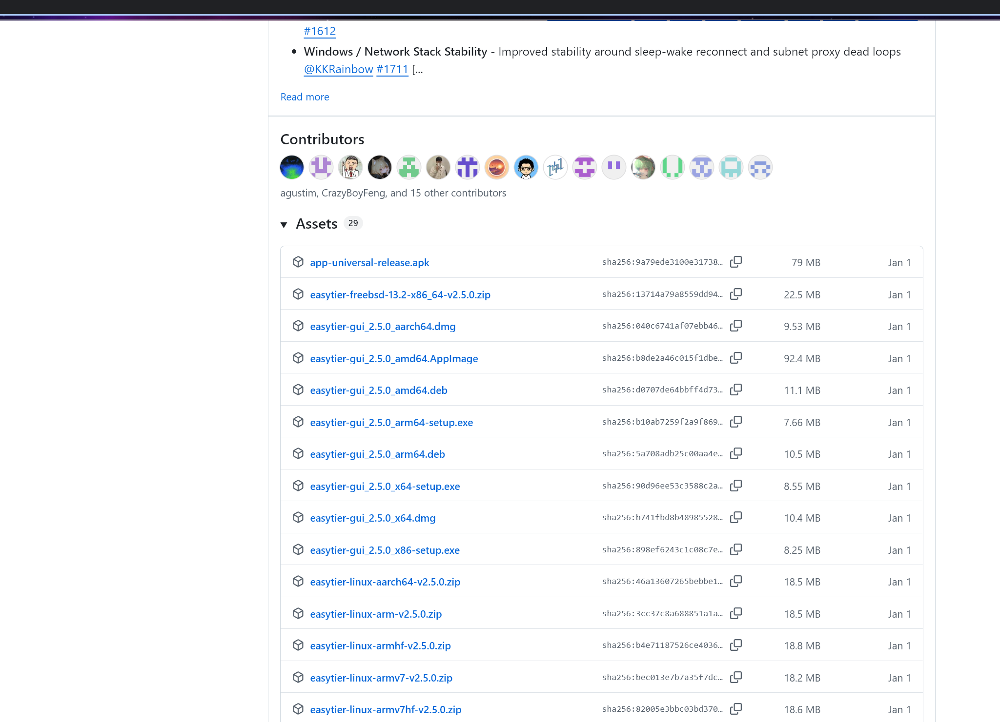
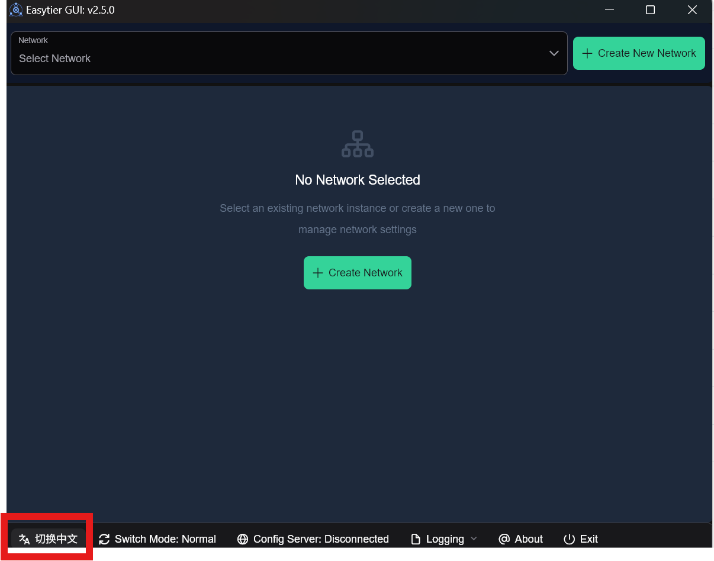
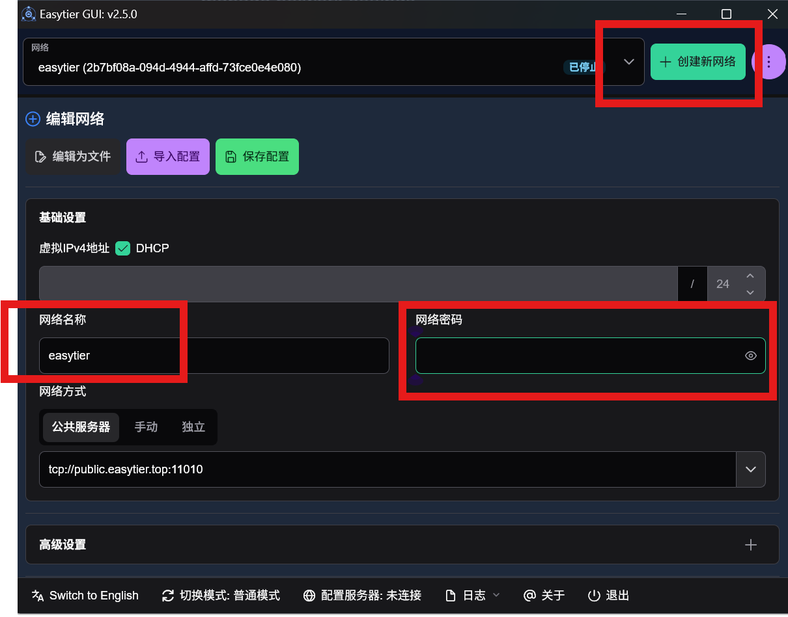
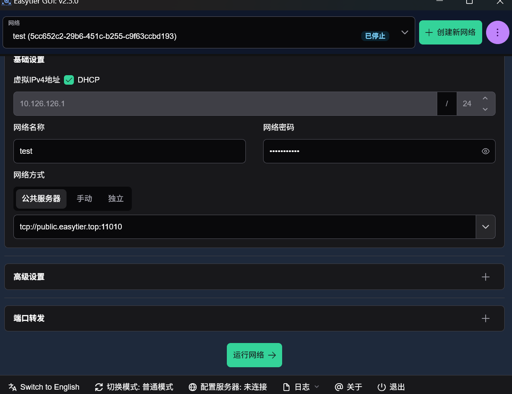
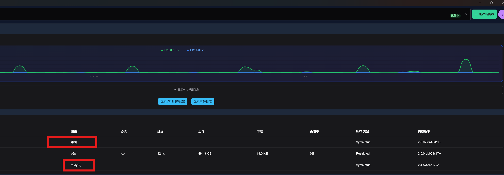

# 1. 远程ADB环境配置

在交叉编译的开发中，模型在服务器编译完成后，需通过数据线或手动传输可执行文件到本地手机测试。

当开发服务器位于内网、手机在开发者本地时，“编译-传输-测试”、调试比较麻烦。

实际上adb提供了远程连接方式，可以**通过端口转发链路，让内网开发服务器直接****adb connect****本地手机**。

## 1.1 网络拓扑

现有网络拓扑：本地机器可以通过跳板机连接开发服务器，同时可以连接测试手机

```
[开发服务器 S, Server] 
       ▲
       │ (内网，仅J可达)
[跳板机 J, Jump] ←──┐
       ▲       (Frp穿透)
       |           │
[本地机器 L, Local] ┘
       │ (adb无线/USB)
       ▼
[测试手机 P, Phone]
```

预期网络拓扑：开发服务器可以直接连接测试手机

```
[开发服务器 S, Server] 
       │ (内网，仅J可达)
       ▼
[跳板机 J, Jump] ←──┐
       │       (Frp穿透)
       ▼           │
[本地机器 L, Local] ┘
       │ (adb无线/USB)
       ▼
[测试手机 P, Phone]
```

- **S (Server)**：代码开发服务器，IP为 $ip_S$，端口 $port_S$
- **J (Jump)**：跳板机
- **L (Local)**：开发者本地机器（Windows/Linux/WSL）
- **P (Phone)**：测试手机，已开启ADB over TCP，IP为 $ip_P$，SSH端口 $port_P$

## 1.2 原理

构建端口转发链路：S($ip_S$: $port_S$) → L($ip_L$: $port_L$) → P($ip_P$: $port_P$)

## 1.3 本地ADB环境配置

手机端开启ADB网络调试，需要自行[安装配置adb](https://zhuanlan.zhihu.com/p/1914080129379968872)， [adb介绍](https://developer.android.com/tools/adb?hl=zh-cn)

```bash
# 通过USB临时连接手机后执行
adb tcpip port_P	# 插入usb连接手机 启动无线adb调试，部分机型可能需要在开发者模式设置允许无线调试
adb connect ip_P:port_P  # 验证无线adb连接，手机的ip可能会随着网络变化，可以在手机设置中搜索ip查看，或者路由器页面查看
```

这里注意WSL中USB设备需由Windows层接管，需要把USB访问权给WSL，[参考文档](https://learn.microsoft.com/en-us/windows/wsl/connect-usb)

## 1.4 构建服务器->本地转发链路(S->L)

### 方案1: SSH端口转发

- 步骤1：服务器S  → 本地L（在本地L建立远程端口转发）

	```bash
	# 本地L 执行
	# 后面user@ip -p port 是本地L通过ssh连接服务器S的user ip port, 不是需要转发的ip和端口
	ssh -N -R 0.0.0.0:port_S:localhost:port_L user@ip -p port 
	
	# 如果本地配置了config, (参考配置链接: https://zhuanlan.zhihu.com/p/1984208939030684698)
	# 假设别名是host_name, 可以修改成下面形式
	ssh -N -R 0.0.0.0:port_S:localhost:port_L host_name
	
	# -N: 只用来转发数据
	# -R: 反向转发
	# 0.0.0.0: 监听跳板机的所有网卡
	```

- 步骤2：测试链路连通，[参考](https://zhuanlan.zhihu.com/p/694098553)

	```bash
	# 每一步可以通过netcat测试链路连通
	# netcat安装: https://www.trae.cn/article/706600706
	
	# 例如: 测试 服务器S → 本地L 连通性
	# 服务器 服务器S端口port_S是否已经转发给本地L端口port_L
	echo "hello" | nc 127.0.0.1 port_S
	# 本地
	nc -l -p port_L
	# 测试成功本地输出hello
	```

### 方案2: TailScale/EasyTier隧道 (推荐)

直接用TailScale/EasyTier打通服务器到本地隧道，TailScale会尝试直连打通隧道，打通成功网速不受限于Frp穿透机器，比较推荐。

- 步骤1：本地L和服务器S分别部署TailScale/EasyTier, [TailScale参考教程](https://tailscale.com/kb/1017/install)， [EasyTier参考教程](https://easytier.cn/guide/introduction.html)
	下面以EasyTier为例，**注意EasyTier需要root权限 并且docker默认不具备TUN 支持，建议联系集群管理员提供隧道通信方式**

	- 本地L安装：从[github-relase](https://github.com/EasyTier/EasyTier/releases)界面，选择对应版本，如winodws选择[easytier-gui_2.5.0_x64-setup.exe](https://github.com/EasyTier/EasyTier/releases/download/v2.5.0/easytier-gui_2.5.0_x64-setup.exe) 随后手动安装

	打开EasyTier, 左下角可以切换中文模式
	

	设置网络名称和密码，然后点击创建新网络，只有网络名和密码匹配才会加入同一个网络，所以网络名设置不要太简单。

	

	滑倒底下 运行网络，本地节点就启动了
	

	- 服务器S节点安装

		```bash
		# 安装
		wget -O- https://raw.githubusercontent.com/EasyTier/EasyTier/main/script/install.sh | sudo bash -s install
		# 配置，需要和前面一致的网络名和密码, 把下面passwd替换密码
		sudo easytier-core -d --network-name test --network-secret "passwd" -p tcp://public.easytier.cn:11010
		
		# 查看节点，这里docker不具备
		easytier-cli peer
		```

		结果如下，这里的公共服务器可以替换为自己的公网服务器。

		| ipv4      | hostname                         | cost     | lat(ms) | loss | rx       | tx      | tunnel | NAT        | version         |
		| --------- | -------------------------------- | -------- | ------- | ---- | -------- | ------- | ------ | ---------- | --------------- |
		| $ip_{S1}$ | -----                            | Local    | -       | -    | -        | -       | -      | Symmetric  | 2.4.5-4c4d172e  |
		|           | PublicServer_hubei-public.easyti | p2p      | 9.42    | 0.0% | 82.91 kB | 8.78 kB | tcp    | Restricted | 2.5.0-db059c17~ |
		| $ip_{L1}$ | -----                            | relay(2) | 18.00   | 0.0% | 0 B      | 0 B     |        | Symmetric  | 2.5.0-88a45d11~ |

		在本地的gui界面可以看见两个节点 和对应IP, 这里测试的docker不支持TUN所以无法打通，自己搭建需要有docker权限且支持TUN
		

- 步骤2：登录TailScale，获取本地L和服务器S分配的ip, 分别记录为$ip_{L1}$ 和$ip_{S1}$。EasyTier直接在界面中获取。

- 步骤3：建立本地L到服务器S的SSH连接，其余配置一样，只需要修改原来通过SSH连接到服务器S的ip为$ip_{S1}$

- 步骤4：同[方案1](#方案1: SSH端口转发)，在本地建立到服务器的反向端口转发

- 注：同理，可以建立服务器到本地的SSH连接，然后在服务器开本地端口转发，[ssh转发参考](https://www.bilibili.com/video/BV1C7411P7Er?spm_id_from=333.788.videopod.episodes&vd_source=df6453dea1e57d74d7c6fae78a4d376e)

## 1.5 构建本地->手机的转发链路(L->P)

```bash
# 本地L执行, 将本地L端口转发至 手机P的adb连接端口
adb forward tcp:port_L tcp:port_P
```

## 1.6 测试

```bash
# 服务器S执行, 已经将服务器端口port_S转发给手机adb端口
# sudo apt install adb -y 若服务器无adb
adb connect 127.0.0.1:port_S
adb devices # 正常显示连接设备
```


